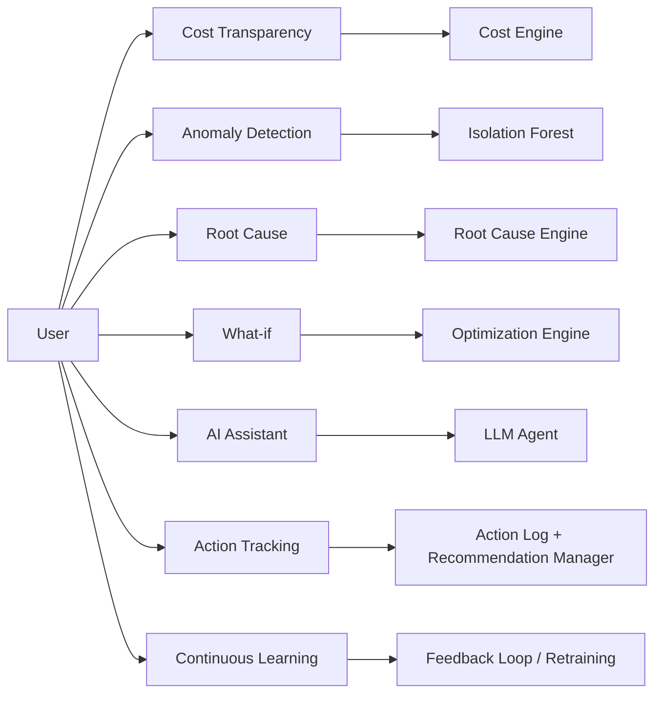

# Feature-wise / Functional Architecture
## AI-Powered Industrial Cost Optimization Assistant — Working Prototype Reference

---

## 1. Purpose

Traces every feature end to end: trigger → data consumed → processing logic → code module → concrete request/response payload → UI surface. This is the "point-to-point" functional spec a developer would build the prototype from.

---

## 2. Feature Inventory

| # | Feature | Module (repo path) | Primary Endpoint |
|---|---|---|---|
| 1 | Cost Transparency | `analytics_ai/cost_engine` | `GET /api/cost/summary` |
| 2 | Anomaly Detection | `analytics_ai/ml_models/anomaly_isolation_forest.py` | `GET /api/anomalies` |
| 3 | Root Cause Analysis | `analytics_ai/root_cause_engine` | `GET /api/rootcause/{id}` |
| 4 | What-if Analysis | `analytics_ai/optimization_engine` | `POST /api/whatif` |
| 5 | AI Assistant | `backend/app/agent` | `WS /ws/chat` |
| 6 | Action Tracking | `backend/app/api/actions.py` | `POST /api/actions/{id}/implement` |
| 7 | Continuous Learning | `data_platform/airflow/dags/kpi_remeasure_dag.py` | (internal) |



---

## 3. Feature 1 — Cost Transparency

**Trigger**: Dashboard load, scheduled report, or API call.

**Inputs**: `plant_id` (optional filter), `line_id` (optional), `date_range`.

**Processing** (`cost_engine/allocate.py`):
```python
def cost_per_unit(material_cost, energy_cost, labor_cost, machine_hours_used,
                   total_plant_hours, total_plant_overhead, units_produced):
    allocated_overhead = (machine_hours_used / total_plant_hours) * total_plant_overhead
    return (material_cost + energy_cost + labor_cost + allocated_overhead) / units_produced
```

**Request**:
```
GET /api/cost/summary?plant_id=PLANT-01&line_id=LINE-03&from=2026-08-01&to=2026-08-30
```

**Response**:
```json
{
  "plant_id": "PLANT-01",
  "line_id": "LINE-03",
  "cost_per_unit": 42.85,
  "baseline_cost_per_unit": 39.10,
  "variance_pct": 9.6,
  "breakdown": {
    "material_cost": 18.20,
    "energy_cost": 12.05,
    "labor_cost": 8.10,
    "allocated_overhead": 4.50
  }
}
```

**Edge Cases**: missing sub-meter data → overhead falls back to plant-level average with `data_completeness_flag: true`; multi-product lines → cost split proportionally by production time per SKU.

---

## 4. Feature 2 — Anomaly Detection

**Trigger**: Continuous, event-driven on every new time-series reading landing in the warehouse.

**Processing** (`ml_models/anomaly_isolation_forest.py`):
```python
from sklearn.ensemble import IsolationForest

model = IsolationForest(contamination=0.02, random_state=42)
model.fit(baseline_features)              # 90-day rolling window per asset/metric
anomaly_score = model.decision_function(current_reading)
is_anomaly    = model.predict(current_reading) == -1
```

**Response** (`GET /api/anomalies`):
```json
[
  {
    "anomaly_id": "AN-20260830-0134",
    "asset_id": "LINE3-EXT-01",
    "metric": "energy_kwh",
    "anomaly_score": 0.81,
    "detected_at": "2026-08-30T03:40:00+05:30",
    "severity": "high",
    "status": "open"
  }
]
```

**Edge Cases**: new assets with <90 days history → fall back to plant-level baseline; declared maintenance windows suppress detection to avoid false positives.

---

## 5. Feature 3 — Root Cause Analysis

**Trigger**: An anomaly is flagged, or a user requests root-cause on a metric.

**Processing** (`root_cause_engine/correlate.py`): pulls candidate drivers active in the anomaly window (maintenance logs, environment, schedule), ranks by correlation strength + Shapley-value contribution, drills down Plant → Line → Machine → Reason.

**Response** (`GET /api/rootcause/AN-20260830-0134`):
```json
{
  "anomaly_id": "AN-20260830-0134",
  "ranked_drivers": [
    {
      "driver": "maintenance_event: chiller filter change skipped (2 cycles)",
      "correlation_strength": 0.79,
      "contribution_pct": 61
    },
    {
      "driver": "ambient_temperature: +4C vs. average",
      "correlation_strength": 0.42,
      "contribution_pct": 24
    }
  ],
  "drill_down_path": ["PLANT-01", "LINE-03", "LINE3-EXT-01", "Chiller filter"],
  "confidence": 0.87
}
```

**Edge Cases**: multiple co-occurring drivers surfaced together, ranked, rather than forcing a single cause; no statistically significant driver → returns `"root_cause": "undetermined"` rather than a low-confidence guess.

---

## 6. Feature 4 — What-if Analysis

**Trigger**: User or Optimization Engine defines a candidate scenario.

**Processing** (`optimization_engine/solve.py`, PuLP/OR-Tools):
```
minimize:    total_cost(x)
subject to:  production_target <= sum(output_i * x_i)
             machine_capacity_i >= x_i        for all i
             safety_constraints(x)
```

**Request**:
```json
POST /api/whatif
{
  "asset_id": "LINE3-EXT-01",
  "candidate_actions": [
    {"action": "filter_replacement", "cost": 1200, "downtime_hours": 0},
    {"action": "setpoint_reduction", "cost": 0, "downtime_hours": 0},
    {"action": "reschedule_cooler_shift", "cost": 300, "downtime_hours": 4}
  ]
}
```

**Response**:
```json
{
  "ranked_scenarios": [
    {"action": "filter_replacement", "projected_savings_quarter": 550000, "payback_days": 2, "feasible": true, "rank": 1},
    {"action": "setpoint_reduction", "projected_savings_quarter": 210000, "payback_days": 0, "feasible": true, "rank": 2},
    {"action": "reschedule_cooler_shift", "projected_savings_quarter": 180000, "payback_days": 5, "feasible": true, "rank": 3}
  ]
}
```

**Edge Cases**: infeasible scenario → `"feasible": false` plus the violated constraint name; competing objectives (cost vs. throughput) reported side by side.

---

## 7. Feature 5 — AI Assistant

**Trigger**: User opens chat and sends a query.

**Processing** (`backend/app/agent/agent.py`): Google Gemini API (free tier, `google-generativeai` SDK) with function-calling; function declarations map 1:1 to the REST endpoints (`get_cost_summary`, `get_anomalies`, `get_root_cause`, `run_whatif`, `get_recommendations`).

**Protocol**: `WS /ws/chat`

**Example exchange**:
```json
// client -> server
{"type": "user_message", "text": "Why did Line 3 cost go up today?"}

// server -> client (streamed)
{"type": "tool_call", "tool": "get_anomalies", "args": {"line_id": "LINE-03"}}
{"type": "tool_call", "tool": "get_root_cause", "args": {"anomaly_id": "AN-20260830-0134"}}
{"type": "agent_text", "text": "Line 3 is running 22% over its energy baseline due to a skipped chiller filter change — replacing it now should save about ₹5.5 lakh this quarter."}
{"type": "evidence_card", "data": { "confidence": 0.87, "driver": "chiller filter" }}
```

**Edge Cases**: ambiguous question → agent asks a clarifying follow-up; question outside data scope → agent states the limitation rather than fabricating.

---

## 8. Feature 6 — Action Tracking

**Trigger**: User marks a recommendation implemented.

**Request**:
```
POST /api/actions/REC-0087/implement
{"implemented_by": "maintenance_team_A", "notes": "Chiller filter replaced"}
```

**Response**:
```json
{
  "action_id": "ACT-0451",
  "recommendation_id": "REC-0087",
  "implemented_at": "2026-08-30T09:15:00+05:30",
  "tracking_status": "pending_verification",
  "verification_due": "2026-09-06T09:15:00+05:30"
}
```

**Processing**: `data_platform/airflow/dags/kpi_remeasure_dag.py` runs 7 days later, re-measures the baseline metric, and updates `tracking_status` to `verified` or `not_resolved`, populating `verified_savings`.

**Edge Cases**: condition recurs → status `not_resolved`, anomaly re-opens rather than marked verified; multiple actions on same asset in tracking window → `attribution: ambiguous` flag.

---

## 9. Feature 7 — Continuous Learning

**Trigger**: Every verified action outcome + newly accumulated baseline history.

**Processing**:
1. Verified outcomes written back to the feature store (`analytics_ai/baseline_engine/feature_store/`).
2. Baselines recalculated on the extended rolling window.
3. Confidence scoring recalibrated from the growing history of past recommendations vs. actual outcomes.
4. Model retraining scheduled (`mlflow` experiment `anomaly-detector-retrain`), versioned, with rollback if the new model underperforms on a holdout set.

**Edge Cases**: a verified outcome contradicting the model's prediction is flagged for manual review rather than silently absorbed (catches data drift early).

---

## 10. Cross-Feature Sequence Diagram

```mermaid
sequenceDiagram
    participant Sensor as IoT Sensor
    participant ML as Anomaly Detection
    participant RCA as Root Cause Engine
    participant OPT as Optimization Engine
    participant Agent as AI Agent
    participant User as Plant Team
    participant Track as Action Tracking
    participant Learn as Feedback Loop

    Sensor->>ML: New reading (Kafka topic iot.energy.readings)
    ML->>ML: Score vs. 90-day baseline
    ML-->>RCA: Anomaly flagged (score 0.81)
    RCA->>RCA: Correlate candidate drivers
    RCA-->>OPT: Root cause + confidence (87%)
    OPT->>OPT: Rank candidate actions
    OPT-->>Agent: Ranked recommendation
    Agent-->>User: NL explanation + evidence card
    User->>Track: POST /api/actions/{id}/implement
    Track->>Track: Start 7-day tracking clock
    Track-->>Learn: kpi_remeasure_dag verifies savings
    Learn-->>ML: Updated baseline / retrained model
    Learn-->>RCA: Recalibrated confidence
```

---

## 11. Feature-to-API-to-Data Traceability Matrix

| Feature | Endpoint | Data Domain | Module |
|---|---|---|---|
| Cost Transparency | `GET /api/cost/summary` | Master, Transactional, Cost | `cost_engine` |
| Anomaly Detection | `GET /api/anomalies` | Time Series, Calculated Metrics | `ml_models` |
| Root Cause Analysis | `GET /api/rootcause/{id}` | Transactional, Time Series, Master | `root_cause_engine` |
| What-if Analysis | `POST /api/whatif` | Cost, Master, Calculated Metrics | `optimization_engine` |
| AI Assistant | `WS /ws/chat` | All (via tool-use) | `backend/app/agent` |
| Action Tracking | `POST /api/actions/{id}/implement` | Action Log | `backend/app/api/actions.py` |
| Continuous Learning | (internal) | Action Log, Time Series | `kpi_remeasure_dag.py` |

---

## 12. Value Delivered

Real-time visibility · data-driven decisions · quantified high-impact opportunities · reduced waste/downtime/energy/quality loss · continuous improvement via the closed feedback loop.
