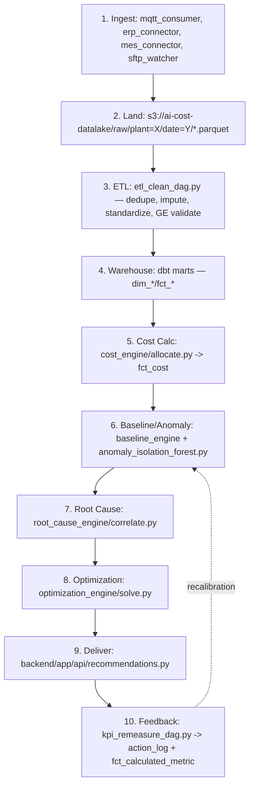

# Data Architecture
## AI-Powered Industrial Cost Optimization Assistant — Working Prototype Reference

---

## 1. Scope

Point-to-point trace of data from shop floor to warehouse: every source, connector, storage path, transformation, and quality gate — with concrete file paths, topic names, and DDL a developer would actually implement.

---

## 2. Layer 1 — Data Sources & Connectors

| Source | System | Protocol | Prototype Connector | Frequency |
|---|---|---|---|---|
| ERP / Finance | SAP / Oracle | REST/OData | `ingestion/erp_connector/main.py` | Every 5–15 min |
| MES / Production | Plant MES/SCADA | REST/SOAP MES API | `ingestion/mes_connector/main.py` | Near-real-time |
| IoT / Sensors | PLC, energy meters | OPC-UA, MQTT | `ingestion/mqtt_consumer/main.py` | Streaming, sub-minute |
| Legacy | Flat-file exports | CSV/SFTP | `ingestion/sftp_watcher/main.py` | Scheduled batch |

### 2.1 MQTT → Kafka Bridge (concrete)

```python
# ingestion/mqtt_consumer/main.py
import paho.mqtt.client as mqtt
from kafka import KafkaProducer
import json, os

producer = KafkaProducer(bootstrap_servers=os.environ["KAFKA_BOOTSTRAP_SERVERS"])

def on_message(client, userdata, msg):
    payload = json.loads(msg.payload)
    topic = f"iot.{payload['metric']}.readings"      # e.g. iot.energy.readings
    producer.send(topic, json.dumps(payload).encode())

client = mqtt.Client()
client.connect(os.environ["MQTT_BROKER_HOST"], int(os.environ["MQTT_BROKER_PORT"]))
client.subscribe("plant/+/machine/+/telemetry")
client.on_message = on_message
client.loop_forever()
```

### 2.2 Kafka Topic Naming Convention

| Topic | Producer | Consumer |
|---|---|---|
| `iot.energy.readings` | mqtt_consumer | etl_clean_dag (streaming task) |
| `iot.machine.readings` | mqtt_consumer | etl_clean_dag |
| `erp.finance.records` | erp_connector | etl_clean_dag |
| `mes.production.events` | mes_connector | etl_clean_dag |

---

## 3. Layer 2 — Data Platform (Concrete Pipeline)

### 3.1 Data Lake Layout (MinIO/S3, Parquet, partitioned)

```
s3://ai-cost-datalake/
└── raw/
    ├── plant=PLANT-01/
    │   └── date=2026-08-30/
    │       ├── energy_readings.parquet
    │       ├── production_events.parquet
    │       └── erp_finance.parquet
    └── plant=PLANT-02/...
```

### 3.2 Airflow DAG — ETL / Cleaning (concrete)

```python
# data_platform/airflow/dags/etl_clean_dag.py
from airflow import DAG
from airflow.operators.python import PythonOperator
from datetime import datetime, timedelta

default_args = {"retries": 3, "retry_delay": timedelta(minutes=5)}

with DAG("etl_clean_dag", schedule_interval="*/10 * * * *",
         start_date=datetime(2026, 1, 1), default_args=default_args, catchup=False) as dag:

    dedupe = PythonOperator(task_id="deduplicate", python_callable=lambda: ...)
    impute = PythonOperator(task_id="handle_missing_values", python_callable=lambda: ...)
    standardize = PythonOperator(task_id="standardize_units", python_callable=lambda: ...)
    validate = PythonOperator(task_id="great_expectations_validate", python_callable=lambda: ...)
    load = PythonOperator(task_id="load_to_warehouse", python_callable=lambda: ...)

    dedupe >> impute >> standardize >> validate >> load
```

### 3.3 Great Expectations Suite (excerpt)

```yaml
# data_platform/great_expectations/expectations/energy_readings_suite.json
expectations:
  - expectation_type: expect_column_values_to_not_be_null
    kwargs: {column: "machine_id"}
  - expectation_type: expect_column_values_to_be_between
    kwargs: {column: "energy_kwh", min_value: 0, max_value: 5000}
  - expectation_type: expect_column_values_to_match_strftime_format
    kwargs: {column: "timestamp", strftime_format: "%Y-%m-%dT%H:%M:%S%z"}
```

### 3.4 dbt Warehouse Models (concrete file layout)

```
data_platform/dbt/models/
├── staging/
│   ├── stg_erp_finance.sql
│   ├── stg_mes_production.sql
│   └── stg_iot_readings.sql
└── marts/
    ├── dim_plant.sql
    ├── dim_machine.sql
    ├── dim_product.sql
    ├── dim_vendor.sql
    ├── fct_production.sql
    ├── fct_cost.sql
    ├── fct_sensor_reading.sql
    └── fct_calculated_metric.sql
```

---

## 4. Layer 3 — Industrial Data Model (Field-Level)

### 4.1 Master Data

| Table | Fields |
|---|---|
| `dim_plant` | plant_id (PK), plant_name, location |
| `dim_machine` | machine_id (PK), plant_id (FK), line, machine_type |
| `dim_product` | product_id (PK), sku, unit_of_measure |
| `dim_vendor` | vendor_id (PK), vendor_name |

### 4.2 Transactional Data

| Table | Fields |
|---|---|
| `fct_work_order` | work_order_id (PK), plant_id (FK), product_id (FK), start_time, end_time |
| `fct_production` | record_id (PK), work_order_id (FK), machine_id (FK), units_produced, shift_start |
| `fct_maintenance_event` | event_id (PK), machine_id (FK), event_type, event_time |
| `fct_purchase_order` | po_id (PK), vendor_id (FK), amount |

### 4.3 Cost Data

| Table | Fields |
|---|---|
| `fct_cost` | cost_id (PK), production_record_id (FK), material_cost, energy_cost, labor_cost, allocated_overhead |

### 4.4 Time Series Data

| Table | Fields |
|---|---|
| `fct_sensor_reading` | reading_id (PK), machine_id (FK), metric, value, timestamp |

### 4.5 Calculated Metrics

| Table | Fields |
|---|---|
| `fct_calculated_metric` | metric_id (PK), production_record_id (FK), metric_name (OEE / cost_per_unit / efficiency / yield), value |

---

## 5. End-to-End Data Flow (10 Steps, Mapped to Files/Topics/Tables)



| Step | Concrete Artifact |
|---|---|
| 1 | `ingestion/mqtt_consumer`, `erp_connector`, `mes_connector`, `sftp_watcher` |
| 2 | MinIO bucket `ai-cost-datalake/raw/plant=.../date=...` |
| 3 | `airflow/dags/etl_clean_dag.py` + `great_expectations/expectations/*.json` |
| 4 | `dbt/models/marts/dim_*.sql`, `fct_*.sql` |
| 5 | `analytics_ai/cost_engine/allocate.py` writing to `fct_cost` |
| 6 | `analytics_ai/baseline_engine` + `ml_models/anomaly_isolation_forest.py` |
| 7 | `analytics_ai/root_cause_engine/correlate.py` |
| 8 | `analytics_ai/optimization_engine/solve.py` |
| 9 | `backend/app/api/recommendations.py` → Dashboard/Alert/Chat |
| 10 | `airflow/dags/kpi_remeasure_dag.py` → `action_log`, `fct_calculated_metric` |

---

## 6. Data Governance & Quality

| Concern | Implementation |
|---|---|
| Single source of truth | All engines read only from `dbt/models/marts/*`, never directly from raw ingestion |
| Data-quality gating | Great Expectations suite must pass before `load_to_warehouse` task runs (Section 3.2) |
| Data lineage | Raw (MinIO) → staged (`stg_*.sql`) → marts (`dim_*`/`fct_*`) → analytics — each a distinct dbt/Airflow stage, visible in Airflow UI and `dbt docs` |
| Retention & partitioning | Raw lake partitioned `plant=/date=`; warehouse fact tables indexed on `(machine_id, timestamp)` for rolling-window queries |
| Feedback integrity | Verified outcomes land in a separate `action_log` table (Postgres), never overwriting raw `fct_sensor_reading` history |

---

## 7. Non-Functional Data Requirements

| Requirement | Target | Enforced By |
|---|---|---|
| Streaming ingestion latency | < 60 seconds sensor → data lake | Kafka + `mqtt_consumer` |
| Batch ingestion latency | 5–15 minutes | `erp_connector` / `mes_connector` schedule |
| Data-quality pass rate | 100% before warehouse load | `great_expectations_validate` task (hard gate — DAG fails and alerts on violation) |
| Baseline history | Minimum 90-day rolling window per asset/metric | `baseline_engine` window config |
| Horizontal scalability | Add plant → add Kafka partition + dbt source, no engine code change | Kafka partition key = `plant_id` |
