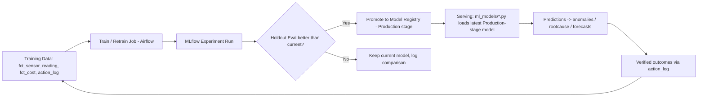

# AI/ML Architecture
## AI-Powered Industrial Cost Optimization Assistant — Working Prototype Reference

---

## 1. Scope

Concrete model-by-model spec: algorithm, training data, code, retraining schedule, evaluation metric, and MLflow tracking — the point-to-point detail needed to actually build and operate the Analytics & AI layer.

---

## 2. Module Layout

```
analytics_ai/
├── cost_engine/
│   └── allocate.py                      # Activity-Based Costing
├── baseline_engine/
│   ├── rolling_baseline.py              # 90-day rolling window, seasonality adjustment
│   └── feature_store/
├── ml_models/
│   ├── anomaly_isolation_forest.py      # Anomaly Detection
│   ├── forecast_prophet_xgboost.py      # Cost/Demand Forecasting
│   └── predictive_maintenance.py        # Scrap/Quality/Failure prediction
├── root_cause_engine/
│   └── correlate.py                     # Correlation + Shapley ranking
├── optimization_engine/
│   └── solve.py                         # LP/MIP via PuLP / OR-Tools
└── mlflow/                              # experiment tracking store (local or hosted)
```

---

## 3. Cost Calculation Engine (Activity-Based Costing)

```python
# analytics_ai/cost_engine/allocate.py
def cost_per_unit(material_cost, energy_cost, labor_cost,
                   machine_hours_used, total_plant_hours,
                   total_plant_overhead, units_produced):
    allocated_overhead = (machine_hours_used / total_plant_hours) * total_plant_overhead
    return (material_cost + energy_cost + labor_cost + allocated_overhead) / units_produced
```

- **Input**: `fct_cost`, `fct_production`, `dim_machine` (for machine-hours), plant-level overhead totals.
- **Output**: `cost_per_unit` written to `fct_calculated_metric` (metric_name = `cost_per_unit`).
- **Variance analysis**: `variance_pct = (actual_cost_per_unit - baseline_cost_per_unit) / baseline_cost_per_unit`.

---

## 4. Baseline & Benchmark Engine

```python
# analytics_ai/baseline_engine/rolling_baseline.py
import pandas as pd

def compute_baseline(readings: pd.DataFrame, window_days=90):
    readings = readings.set_index("timestamp")
    # seasonality-aware rolling mean, resampled hourly, adjusted for shift/day-of-week
    baseline = readings["value"].rolling(f"{window_days}D").mean()
    seasonal_factor = readings.groupby(readings.index.hour)["value"].transform("mean") / readings["value"].mean()
    return baseline * seasonal_factor
```

- Normalizes per unit produced / per hour to make cross-shift and cross-product comparisons fair.
- Baseline is recalculated nightly via a scheduled Airflow task and stored in `baseline_engine/feature_store/`.

---

## 5. ML Models

### 5.1 Anomaly Detection — Isolation Forest

```python
# analytics_ai/ml_models/anomaly_isolation_forest.py
from sklearn.ensemble import IsolationForest
import mlflow

with mlflow.start_run(run_name="anomaly-detector-train"):
    model = IsolationForest(contamination=0.02, random_state=42)
    model.fit(baseline_features)                       # 90-day rolling window per asset/metric
    mlflow.sklearn.log_model(model, "isolation_forest")
    mlflow.log_param("contamination", 0.02)

anomaly_score = model.decision_function(current_reading)
is_anomaly    = model.predict(current_reading) == -1
```

| Property | Value |
|---|---|
| Algorithm | Isolation Forest (scikit-learn) |
| Training window | Rolling 90 days, per asset/metric |
| Contamination rate | 0.02 (tuned for shop-floor false-positive tolerance) |
| Retraining cadence | Nightly (Airflow scheduled task `retrain_anomaly_model`) |
| Tracking | MLflow experiment `anomaly-detector-train`, versioned model registry |
| Fallback | New assets (<90 days history) use plant-level aggregate baseline |

### 5.2 Forecasting — Prophet + XGBoost Ensemble

```python
# analytics_ai/ml_models/forecast_prophet_xgboost.py
from prophet import Prophet
from xgboost import XGBRegressor

prophet_model = Prophet(seasonality_mode="multiplicative")
prophet_model.fit(seasonal_history_df)

xgb_model = XGBRegressor(n_estimators=300, max_depth=6)
xgb_model.fit(feature_matrix, target)

# Model selected per metric based on backtest MAPE
selected_model = prophet_model if prophet_mape < xgb_mape else xgb_model
```

| Property | Value |
|---|---|
| Use cases | Cost forecasting, demand/production forecasting |
| Model selection | Backtested per metric; lower MAPE wins |
| Evaluation metric | MAPE (Mean Absolute Percentage Error) on holdout window |
| Retraining cadence | Weekly |

### 5.3 Predictive Maintenance / Scrap-Quality Prediction

- Classification model (gradient-boosted trees) predicting failure/scrap probability from `fct_sensor_reading` + `fct_maintenance_event` history.
- Output feeds the Root Cause Analysis Engine as an additional candidate driver (e.g., "elevated failure probability precedes this anomaly").

---

## 6. Root Cause Analysis Engine

```python
# analytics_ai/root_cause_engine/correlate.py
import shap

def rank_drivers(anomaly_window_df, candidate_drivers_df, trained_model):
    correlations = candidate_drivers_df.corrwith(anomaly_window_df["value"])
    shap_values = shap.TreeExplainer(trained_model).shap_values(candidate_drivers_df)
    ranked = sorted(
        zip(candidate_drivers_df.columns, correlations, shap_values.mean(axis=0)),
        key=lambda x: abs(x[2]), reverse=True
    )
    return ranked   # [(driver_name, correlation_strength, shap_contribution), ...]
```

- **Drill-down path**: Plant → Line → Machine → Reason, constructed by walking `dim_plant` → `dim_machine` → the ranked driver.
- **Confidence score** = weighted function of (correlation strength, historical accuracy of similar past diagnoses from `action_log`, data completeness ratio).

```python
def confidence_score(correlation_strength, historical_accuracy, data_completeness):
    return round(100 * (0.5 * correlation_strength + 0.3 * historical_accuracy + 0.2 * data_completeness), 1)
```

---

## 7. Optimization Engine

```python
# analytics_ai/optimization_engine/solve.py
from pulp import LpProblem, LpMinimize, LpVariable, lpSum

problem = LpProblem("cost_minimization", LpMinimize)
x = {i: LpVariable(f"action_{i}", cat="Binary") for i in candidate_actions}

problem += lpSum(action_cost[i] * x[i] for i in candidate_actions)          # objective
problem += lpSum(output[i] * x[i] for i in candidate_actions) >= production_target
for i in candidate_actions:
    problem += x[i] <= machine_capacity[i]
problem.solve()
```

- Ranks candidate actions by projected savings vs. effort/feasibility.
- Constraint types: production target, machine capacity, safety constraints.
- Output consumed by `POST /api/whatif` and the Recommendation Manager.

---

## 8. Confidence Scoring (System-Wide)

Every recommendation ships with a 0–100% confidence score derived from:
1. Correlation strength of the identified driver.
2. Historical accuracy of similar past recommendations (queried from `action_log`).
3. Completeness of the underlying data (ratio of expected vs. actual data points in the window).

---

## 9. MLOps / Model Lifecycle



| Stage | Tooling |
|---|---|
| Experiment tracking | MLflow (`analytics_ai/mlflow/`) |
| Model registry | MLflow Model Registry, stages: Staging → Production → Archived |
| Retraining schedule | Anomaly model: nightly; Forecast models: weekly; Root-cause weighting: on each verified action outcome |
| Rollback | Registry keeps prior Production version; rollback = re-tag previous version as Production |

---

## 10. Worked Example — Model Outputs Chained

1. `anomaly_isolation_forest.py` → `anomaly_score = 0.81` on `LINE3-EXT-01`, `energy_kwh`.
2. `root_cause_engine/correlate.py` → top driver `chiller filter change skipped`, `confidence = 87%`.
3. `cost_engine/allocate.py` → impact ≈ ₹18,400/day, ≈ ₹5.5 lakh/quarter.
4. `optimization_engine/solve.py` → ranks filter replacement as optimal action.
5. `kpi_remeasure_dag.py` (7 days later) → verified savings written to `action_log`, feeds back into `baseline_engine` and next `anomaly-detector-train` run.

---

## 11. Technology Stack Reference

| Purpose | Technology |
|---|---|
| Data science / modeling | Python, pandas, scikit-learn, Prophet, XGBoost |
| Anomaly / outlier detection | PyOD, scikit-learn IsolationForest |
| Optimization | PuLP, OR-Tools |
| Experiment tracking & registry | MLflow |
| Natural-language layer | Google Gemini API (free tier) with function-calling, via `google-generativeai` SDK |
