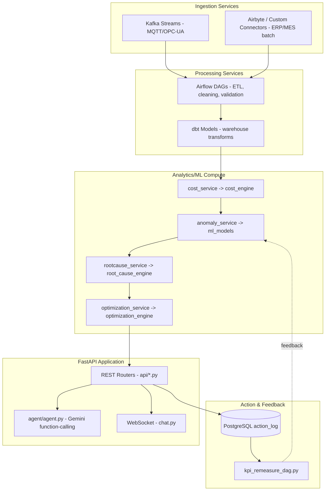
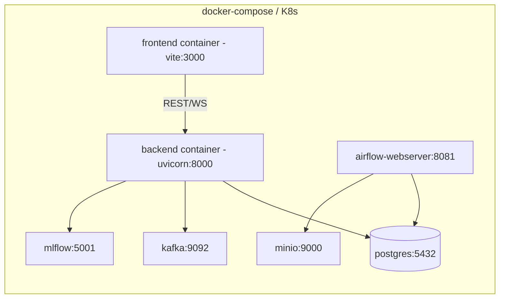

# Backend Architecture
## AI-Powered Industrial Cost Optimization Assistant — Working Prototype Reference

---

## 1. Scope

Point-to-point spec of every backend service: file layout, framework, endpoints, background jobs, auth, and deployment — enough detail to actually stand the backend up.

---

## 2. Backend Technology Stack

| Layer | Purpose | Technology |
|---|---|---|
| Data Sources / Connectors | Connect to ERP, MES, IoT, on-site systems | REST/OData (SAP/Oracle), OPC-UA & MQTT, MES APIs, CSV/SFTP |
| Data Platform | Ingest, store, clean, warehouse | Apache Kafka, Airbyte/custom connectors, S3/ADLS (MinIO in dev), Apache Airflow, Snowflake/PostgreSQL |
| Industrial Data Model | Structure data | dbt, star schema, Great Expectations |
| Analytics & AI | Compute, detect, forecast, optimize | Python (pandas, scikit-learn, Prophet/XGBoost), PyOD, PuLP/OR-Tools, MLflow |
| AI Agent & Application (backend) | NL interaction, serving | Google Gemini API (free tier, `google-generativeai` SDK) with function-calling, FastAPI, WebSocket |
| Action & Feedback Loop | Track & measure | PostgreSQL action-log table, scheduled Airflow job |

---

## 3. Backend Repository Layout (concrete)

```
backend/
├── app/
│   ├── main.py                       # FastAPI app entrypoint, CORS, startup events
│   ├── api/
│   │   ├── cost.py                   # GET /api/cost/summary
│   │   ├── anomalies.py              # GET /api/anomalies
│   │   ├── rootcause.py              # GET /api/rootcause/{id}
│   │   ├── whatif.py                 # POST /api/whatif
│   │   ├── recommendations.py        # GET /api/recommendations
│   │   ├── actions.py                # POST /api/actions/{id}/implement
│   │   └── chat.py                   # WS /ws/chat
│   ├── agent/
│   │   ├── agent.py                  # Gemini API client (google-generativeai) + function-calling loop
│   │   └── tools.py                  # function-declaration schemas mapping to api/*.py
│   ├── db/
│   │   ├── session.py                # SQLAlchemy engine/session
│   │   ├── models.py                 # ORM models: Anomaly, Recommendation, ActionLog
│   │   └── migrations/               # Alembic migrations
│   ├── core/
│   │   ├── config.py                 # Pydantic settings from .env
│   │   ├── security.py               # JWT auth, API key validation
│   │   └── logging.py
│   └── services/
│       ├── cost_service.py           # calls analytics_ai/cost_engine
│       ├── anomaly_service.py        # calls analytics_ai/ml_models
│       ├── rootcause_service.py
│       └── optimization_service.py
├── requirements.txt
├── Dockerfile
└── tests/
```

---

## 4. FastAPI Entrypoint (concrete)

```python
# backend/app/main.py
from fastapi import FastAPI
from fastapi.middleware.cors import CORSMiddleware
from app.api import cost, anomalies, rootcause, whatif, recommendations, actions, chat

app = FastAPI(title="AI Cost Optimization Assistant", version="1.0.0")

app.add_middleware(CORSMiddleware, allow_origins=["*"], allow_methods=["*"], allow_headers=["*"])

app.include_router(cost.router,            prefix="/api/cost",            tags=["cost"])
app.include_router(anomalies.router,       prefix="/api/anomalies",       tags=["anomalies"])
app.include_router(rootcause.router,       prefix="/api/rootcause",       tags=["rootcause"])
app.include_router(whatif.router,          prefix="/api/whatif",          tags=["whatif"])
app.include_router(recommendations.router, prefix="/api/recommendations", tags=["recommendations"])
app.include_router(actions.router,         prefix="/api/actions",         tags=["actions"])
app.include_router(chat.router,            prefix="/ws",                  tags=["chat"])

@app.get("/health")
def health():
    return {"status": "ok"}
```

---

## 5. Service Responsibilities & Flow



---

## 6. Endpoint-by-Endpoint Backend Detail

| Endpoint | Router File | Service Called | DB Table(s) Touched |
|---|---|---|---|
| `GET /api/cost/summary` | `api/cost.py` | `services/cost_service.py` → `cost_engine/allocate.py` | `fct_cost`, `fct_calculated_metric` |
| `GET /api/anomalies` | `api/anomalies.py` | `services/anomaly_service.py` → `ml_models/anomaly_isolation_forest.py` | `anomalies` |
| `GET /api/rootcause/{id}` | `api/rootcause.py` | `services/rootcause_service.py` → `root_cause_engine/correlate.py` | `anomalies`, `fct_maintenance_event` |
| `POST /api/whatif` | `api/whatif.py` | `services/optimization_service.py` → `optimization_engine/solve.py` | (stateless compute) |
| `GET /api/recommendations` | `api/recommendations.py` | Recommendation Manager logic | `recommendations` |
| `POST /api/actions/{id}/implement` | `api/actions.py` | Action-log writer | `action_log` |
| `WS /ws/chat` | `api/chat.py` | `agent/agent.py` (calls all of the above as tools) | (read-only across all) |

---

## 7. Authentication & Security

```python
# backend/app/core/security.py
from fastapi import Depends, HTTPException, Header
import jwt, os

def verify_token(authorization: str = Header(...)):
    try:
        token = authorization.replace("Bearer ", "")
        return jwt.decode(token, os.environ["JWT_SECRET"], algorithms=["HS256"])
    except jwt.InvalidTokenError:
        raise HTTPException(status_code=401, detail="Invalid or expired token")
```

| Concern | Approach |
|---|---|
| Authentication | JWT bearer tokens on all REST endpoints and the WebSocket handshake |
| Source-system credentials | Stored per-connector in `.env` (dev) / secret manager (prod), never in code |
| Rate limiting | Per-API-key limit at the FastAPI gateway/middleware layer |
| Audit trail | Every `POST /api/actions/{id}/implement` call is logged with `implemented_by` in `action_log` |

---

## 8. Background Jobs (Airflow-Orchestrated)

| Job | Schedule | File | Purpose |
|---|---|---|---|
| `etl_clean_dag` | Every 10 min | `data_platform/airflow/dags/etl_clean_dag.py` | Clean & load new data |
| `warehouse_load_dag` | Every 10 min (after ETL) | `warehouse_load_dag.py` | dbt run to materialize marts |
| `retrain_anomaly_model` | Nightly | (in `ml_models/`) | Retrain Isolation Forest on latest 90-day window |
| `kpi_remeasure_dag` | Daily, checks 7-day-old actions | `kpi_remeasure_dag.py` | Verify savings, write to `action_log`, feed back to baseline |

---

## 9. Deployment Topology



| Concern | Prototype Approach |
|---|---|
| Scalability | FastAPI run behind Uvicorn workers (`--workers 4`); Kafka partitions scale ingestion |
| Reliability | Great Expectations gates bad data; MLflow registry supports model rollback |
| Observability | `/health` endpoint, Airflow UI, MLflow UI, structured JSON logging (`core/logging.py`) |
| Config management | `core/config.py` (Pydantic `BaseSettings`) reads all values from `.env` |
