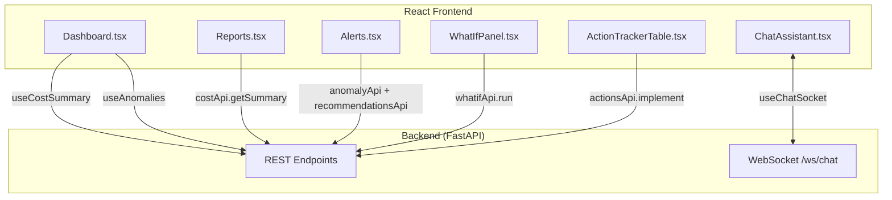

# Frontend Architecture
## AI-Powered Industrial Cost Optimization Assistant — Working Prototype Reference

---

## 1. Scope

Concrete React application structure: pages, components, state management, routing, API clients, and how each screen maps to a backend endpoint — the detail needed to actually build the frontend described in the PDF's Layer 5 (Applications: Dashboard, Reports, Alerts, Chat Assistant, Mobile App).

---

## 2. Frontend Technology Stack

| Concern | Technology |
|---|---|
| Framework | React 18 + Vite |
| Data fetching / caching | TanStack Query (React Query) |
| Real-time | Native WebSocket client wrapped in a React hook |
| Styling | Tailwind CSS |
| Charts | Recharts (cost trends, variance, anomaly timelines) |
| Routing | React Router |
| State (UI-local) | React Context / Zustand for lightweight global state (selected plant/line filters) |

---

## 3. Repository Layout (concrete)

```
frontend/
├── src/
│   ├── main.tsx
│   ├── App.tsx                       # Router setup
│   ├── pages/
│   │   ├── Dashboard.tsx             # cost + anomaly overview
│   │   ├── Reports.tsx               # periodic cost/savings reports
│   │   ├── Alerts.tsx                # anomaly/recommendation alerts feed
│   │   ├── ChatAssistant.tsx         # WS-driven chat UI
│   │   └── Mobile/                   # mobile-optimized views (responsive variants)
│   ├── components/
│   │   ├── CostSummaryCard.tsx
│   │   ├── AnomalyList.tsx
│   │   ├── RootCauseDrilldown.tsx
│   │   ├── WhatIfPanel.tsx
│   │   ├── RecommendationCard.tsx
│   │   ├── ActionTrackerTable.tsx
│   │   └── EvidenceCard.tsx
│   ├── api/
│   │   ├── client.ts                 # axios/fetch instance, JWT header injection
│   │   ├── costApi.ts                # GET /api/cost/summary
│   │   ├── anomalyApi.ts             # GET /api/anomalies
│   │   ├── rootcauseApi.ts           # GET /api/rootcause/{id}
│   │   ├── whatifApi.ts              # POST /api/whatif
│   │   ├── recommendationsApi.ts     # GET /api/recommendations
│   │   ├── actionsApi.ts             # POST /api/actions/{id}/implement
│   │   └── chatSocket.ts             # WS /ws/chat client
│   ├── hooks/
│   │   ├── useCostSummary.ts
│   │   ├── useAnomalies.ts
│   │   └── useChatSocket.ts
│   └── store/
│       └── filterStore.ts            # selected plant/line/date-range (Zustand)
├── package.json
└── vite.config.ts
```

---

## 4. Routing Table

| Route | Page Component | Backend Endpoint(s) Used |
|---|---|---|
| `/` | `Dashboard.tsx` | `GET /api/cost/summary`, `GET /api/anomalies` |
| `/reports` | `Reports.tsx` | `GET /api/cost/summary` (date-ranged) |
| `/alerts` | `Alerts.tsx` | `GET /api/anomalies`, `GET /api/recommendations` |
| `/chat` | `ChatAssistant.tsx` | `WS /ws/chat` |
| `/anomaly/:id/rootcause` | `RootCauseDrilldown.tsx` | `GET /api/rootcause/{id}` |
| `/whatif` | `WhatIfPanel.tsx` | `POST /api/whatif` |
| `/actions` | `ActionTrackerTable.tsx` | `GET /api/recommendations`, `POST /api/actions/{id}/implement` |

---

## 5. Component Flow Diagram



---

## 6. Key Component Implementations (concrete)

### 6.1 Cost Summary Hook (React Query)

```tsx
// src/hooks/useCostSummary.ts
import { useQuery } from "@tanstack/react-query";
import { getCostSummary } from "../api/costApi";

export function useCostSummary(plantId: string, lineId: string, dateRange: [string, string]) {
  return useQuery({
    queryKey: ["costSummary", plantId, lineId, dateRange],
    queryFn: () => getCostSummary(plantId, lineId, dateRange),
    refetchInterval: 60_000, // refresh every 60s
  });
}
```

### 6.2 Chat WebSocket Hook

```tsx
// src/hooks/useChatSocket.ts
import { useEffect, useRef, useState } from "react";

export function useChatSocket() {
  const [messages, setMessages] = useState<any[]>([]);
  const ws = useRef<WebSocket | null>(null);

  useEffect(() => {
    ws.current = new WebSocket(`${import.meta.env.VITE_WS_URL}/ws/chat`);
    ws.current.onmessage = (event) => {
      setMessages((prev) => [...prev, JSON.parse(event.data)]);
    };
    return () => ws.current?.close();
  }, []);

  const sendMessage = (text: string) =>
    ws.current?.send(JSON.stringify({ type: "user_message", text }));

  return { messages, sendMessage };
}
```

### 6.3 Recommendation Card (evidence-first UI)

```tsx
// src/components/RecommendationCard.tsx
export function RecommendationCard({ rec }: { rec: Recommendation }) {
  return (
    <div className="rounded-xl border p-4 shadow-sm">
      <h3 className="font-semibold">{rec.action}</h3>
      <p>Projected savings: ₹{rec.projected_savings.toLocaleString()}</p>
      <p>Confidence: {rec.confidence * 100}%</p>
      <EvidenceCard evidence={rec.evidence} />
      <button onClick={() => implementAction(rec.recommendation_id)}>
        Mark Implemented
      </button>
    </div>
  );
}
```

---

## 7. State Management Strategy

| State Type | Tool | Example |
|---|---|---|
| Server state (API data) | React Query | Cost summary, anomalies, recommendations — cached, auto-refetched |
| UI-local/global filters | Zustand (`filterStore.ts`) | Selected plant/line/date-range shared across Dashboard, Reports, Alerts |
| Real-time stream state | Local component state via `useChatSocket` | Chat message history |
| Auth state | React Context | JWT token, current user |

---

## 8. Application Surfaces (from Layer 5)

| Application | Role | Primary Components |
|---|---|---|
| Dashboard | Real-time cost/anomaly overview | `CostSummaryCard`, `AnomalyList` |
| Reports | Periodic cost/savings views | `Reports.tsx` with date-range picker |
| Alerts | Push notifications for anomalies/recommendations | `Alerts.tsx`, `RecommendationCard` |
| Chat Assistant | NL Q&A with evidence | `ChatAssistant.tsx`, `EvidenceCard` |
| Mobile App | On-the-go access | Responsive variants under `pages/Mobile/` reusing the same API clients |

---

## 9. Non-Functional Frontend Considerations

| Concern | Approach |
|---|---|
| Responsiveness | Tailwind responsive utility classes; dedicated mobile layout variants |
| Accessibility | Semantic HTML, ARIA labels on interactive evidence cards and charts |
| Performance | React Query caching + `refetchInterval` tuned per screen; code-splitting per route |
| Real-time reliability | WebSocket auto-reconnect with exponential backoff in `useChatSocket` |
| Consistent data contract | All surfaces (Dashboard/Reports/Alerts/Chat/Mobile) consume the same REST/WebSocket API, ensuring one consistent view across devices |
