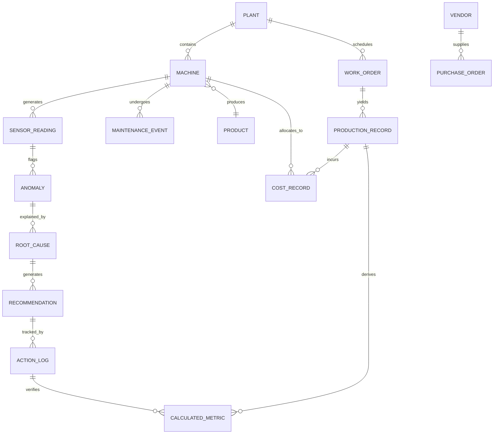

# Database / ER Architecture
## AI-Powered Industrial Cost Optimization Assistant — Working Prototype Reference

---

## 1. Scope

Full field-level schema with concrete `CREATE TABLE` DDL, keys, indexes, and relationships — derived from the Industrial Data Model's stated domains (Master, Transactional, Cost, Time Series, Calculated Metrics) plus the Action Log, star-schema modeled via dbt into Snowflake/PostgreSQL.

> Note: the source PDF/image specify the data domains and warehouse technology but not a literal ER diagram; the schema below is the concrete implementation derived from those domains.

---

## 2. Conceptual ER Diagram



---

## 3. Full DDL — Master Data (Dimensions)

```sql
CREATE TABLE dim_plant (
    plant_id      VARCHAR(20)   PRIMARY KEY,
    plant_name    VARCHAR(120)  NOT NULL,
    location      VARCHAR(200),
    created_at    TIMESTAMPTZ   NOT NULL DEFAULT now()
);

CREATE TABLE dim_machine (
    machine_id    VARCHAR(30)   PRIMARY KEY,
    plant_id      VARCHAR(20)   NOT NULL REFERENCES dim_plant(plant_id),
    line          VARCHAR(50)   NOT NULL,
    machine_type  VARCHAR(80),
    created_at    TIMESTAMPTZ   NOT NULL DEFAULT now()
);
CREATE INDEX idx_machine_plant ON dim_machine(plant_id);

CREATE TABLE dim_product (
    product_id    VARCHAR(20)   PRIMARY KEY,
    sku           VARCHAR(50)   NOT NULL UNIQUE,
    unit_of_measure VARCHAR(20) NOT NULL
);

CREATE TABLE dim_vendor (
    vendor_id     VARCHAR(20)   PRIMARY KEY,
    vendor_name   VARCHAR(150)  NOT NULL
);
```

---

## 4. Full DDL — Transactional Data (Facts)

```sql
CREATE TABLE fct_work_order (
    work_order_id VARCHAR(30)   PRIMARY KEY,
    plant_id      VARCHAR(20)   NOT NULL REFERENCES dim_plant(plant_id),
    product_id    VARCHAR(20)   NOT NULL REFERENCES dim_product(product_id),
    start_time    TIMESTAMPTZ   NOT NULL,
    end_time      TIMESTAMPTZ
);
CREATE INDEX idx_workorder_plant_time ON fct_work_order(plant_id, start_time);

CREATE TABLE fct_production (
    record_id       VARCHAR(30) PRIMARY KEY,
    work_order_id   VARCHAR(30) NOT NULL REFERENCES fct_work_order(work_order_id),
    machine_id      VARCHAR(30) NOT NULL REFERENCES dim_machine(machine_id),
    units_produced  NUMERIC(14,2) NOT NULL,
    shift_start     TIMESTAMPTZ NOT NULL
);
CREATE INDEX idx_production_machine_shift ON fct_production(machine_id, shift_start);

CREATE TABLE fct_maintenance_event (
    event_id      VARCHAR(30)   PRIMARY KEY,
    machine_id    VARCHAR(30)   NOT NULL REFERENCES dim_machine(machine_id),
    event_type    VARCHAR(80)   NOT NULL,   -- e.g. 'filter_change', 'inspection'
    event_time    TIMESTAMPTZ   NOT NULL
);
CREATE INDEX idx_maintenance_machine_time ON fct_maintenance_event(machine_id, event_time);

CREATE TABLE fct_purchase_order (
    po_id         VARCHAR(30)   PRIMARY KEY,
    vendor_id     VARCHAR(20)   NOT NULL REFERENCES dim_vendor(vendor_id),
    amount        NUMERIC(14,2) NOT NULL
);
```

---

## 5. Full DDL — Cost Data

```sql
CREATE TABLE fct_cost (
    cost_id               VARCHAR(30)   PRIMARY KEY,
    production_record_id  VARCHAR(30)   NOT NULL REFERENCES fct_production(record_id),
    material_cost         NUMERIC(14,2) NOT NULL DEFAULT 0,
    energy_cost           NUMERIC(14,2) NOT NULL DEFAULT 0,
    labor_cost            NUMERIC(14,2) NOT NULL DEFAULT 0,
    allocated_overhead    NUMERIC(14,2) NOT NULL DEFAULT 0,
    computed_at           TIMESTAMPTZ   NOT NULL DEFAULT now()
);
CREATE INDEX idx_cost_production ON fct_cost(production_record_id);
```

---

## 6. Full DDL — Time Series Data

```sql
CREATE TABLE fct_sensor_reading (
    reading_id    BIGSERIAL     PRIMARY KEY,
    machine_id    VARCHAR(30)   NOT NULL REFERENCES dim_machine(machine_id),
    metric        VARCHAR(50)   NOT NULL,   -- e.g. 'energy_kwh', 'temperature_c'
    value         NUMERIC(14,4) NOT NULL,
    timestamp     TIMESTAMPTZ   NOT NULL
);
CREATE INDEX idx_sensor_machine_metric_time ON fct_sensor_reading(machine_id, metric, timestamp);
-- Partitioned by month in production (Snowflake: clustered by plant/date)
```

---

## 7. Full DDL — Calculated Metrics

```sql
CREATE TABLE fct_calculated_metric (
    metric_id             VARCHAR(30)   PRIMARY KEY,
    production_record_id  VARCHAR(30)   REFERENCES fct_production(record_id),
    metric_name           VARCHAR(50)   NOT NULL,   -- 'OEE' | 'cost_per_unit' | 'efficiency' | 'yield'
    value                 NUMERIC(14,4) NOT NULL,
    computed_at           TIMESTAMPTZ   NOT NULL DEFAULT now()
);
CREATE INDEX idx_metric_name_time ON fct_calculated_metric(metric_name, computed_at);
```

---

## 8. Full DDL — Analytics / Action Trail (Closed-Loop Tables)

```sql
CREATE TABLE anomalies (
    anomaly_id     VARCHAR(30)   PRIMARY KEY,
    machine_id     VARCHAR(30)   NOT NULL REFERENCES dim_machine(machine_id),
    metric         VARCHAR(50)   NOT NULL,
    anomaly_score  NUMERIC(5,4)  NOT NULL,
    detected_at    TIMESTAMPTZ   NOT NULL,
    severity       VARCHAR(10)   NOT NULL,   -- 'low' | 'medium' | 'high'
    status         VARCHAR(20)   NOT NULL DEFAULT 'open'
);
CREATE INDEX idx_anomaly_machine_time ON anomalies(machine_id, detected_at);

CREATE TABLE root_causes (
    root_cause_id  VARCHAR(30)   PRIMARY KEY,
    anomaly_id     VARCHAR(30)   NOT NULL REFERENCES anomalies(anomaly_id),
    driver         VARCHAR(200)  NOT NULL,
    confidence     NUMERIC(5,4)  NOT NULL
);

CREATE TABLE recommendations (
    recommendation_id  VARCHAR(30)   PRIMARY KEY,
    root_cause_id      VARCHAR(30)   NOT NULL REFERENCES root_causes(root_cause_id),
    action             VARCHAR(200)  NOT NULL,
    projected_savings  NUMERIC(14,2) NOT NULL,
    confidence         NUMERIC(5,4)  NOT NULL,
    created_at         TIMESTAMPTZ   NOT NULL DEFAULT now()
);

CREATE TABLE action_log (
    action_id          VARCHAR(30)   PRIMARY KEY,
    recommendation_id  VARCHAR(30)   NOT NULL REFERENCES recommendations(recommendation_id),
    implemented_by     VARCHAR(100),
    implemented_at     TIMESTAMPTZ   NOT NULL,
    tracking_status    VARCHAR(20)   NOT NULL DEFAULT 'pending_verification', -- pending_verification | verified | not_resolved
    verified_savings   NUMERIC(14,2),
    verified_at        TIMESTAMPTZ
);
CREATE INDEX idx_actionlog_status ON action_log(tracking_status);
```

---

## 9. Table Groupings (per Industrial Data Model)

| Domain | Tables |
|---|---|
| Master Data (dimensions) | `dim_plant`, `dim_machine`, `dim_product`, `dim_vendor` |
| Transactional Data (facts) | `fct_work_order`, `fct_production`, `fct_maintenance_event`, `fct_purchase_order` |
| Cost Data (facts) | `fct_cost` |
| Time Series Data | `fct_sensor_reading` |
| Calculated Metrics | `fct_calculated_metric` |
| Analytics / Action Trail | `anomalies` → `root_causes` → `recommendations` → `action_log` |

---

## 10. Sample Queries (concrete, used by the backend services)

```sql
-- Cost Transparency: cost-per-unit by line for a date range
SELECT dm.line, SUM(fc.material_cost + fc.energy_cost + fc.labor_cost + fc.allocated_overhead)
       / SUM(fp.units_produced) AS cost_per_unit
FROM fct_cost fc
JOIN fct_production fp ON fc.production_record_id = fp.record_id
JOIN dim_machine dm ON fp.machine_id = dm.machine_id
WHERE dm.plant_id = 'PLANT-01' AND fp.shift_start BETWEEN '2026-08-01' AND '2026-08-30'
GROUP BY dm.line;

-- Anomaly Detection feed: open high-severity anomalies
SELECT * FROM anomalies WHERE status = 'open' AND severity = 'high' ORDER BY detected_at DESC;

-- Root Cause drill-down for one anomaly
SELECT rc.driver, rc.confidence
FROM root_causes rc
WHERE rc.anomaly_id = 'AN-20260830-0134'
ORDER BY rc.confidence DESC;

-- Action tracking: recommendations pending verification
SELECT r.action, al.implemented_at, al.tracking_status
FROM action_log al
JOIN recommendations r ON al.recommendation_id = r.recommendation_id
WHERE al.tracking_status = 'pending_verification';
```

---

## 11. Modeling Notes

- Modeled as a **star schema** via dbt: `dim_plant`, `dim_machine`, `dim_product`, `dim_vendor` are dimensions; `fct_production`, `fct_cost`, `fct_sensor_reading` are the primary fact tables.
- **Great Expectations** validates data quality (completeness, ranges, unit consistency) before rows land in these tables.
- **Partitioning**: `fct_sensor_reading` partitioned/clustered by `(machine_id, timestamp)` for efficient rolling-window baseline queries; production warehouse (Snowflake) additionally clusters by plant/date.
- **Retention**: raw time-series retained per compliance/storage policy (e.g., 2 years hot, archived thereafter to the data lake).
- The **`action_log`** table is the audit trail that closes the loop: it links a `recommendation` back to the `root_cause`/`anomaly` it was meant to fix and records the verified outcome once re-measured by `kpi_remeasure_dag.py`.
