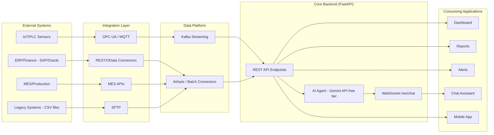

# API & Integration Architecture
## AI-Powered Industrial Cost Optimization Assistant — Working Prototype Reference

---

## 1. Scope

Full API contract — every endpoint's method, path, auth, request schema, response schema, error codes — plus every inbound integration connector, protocol, and cadence. This is the point-to-point contract a frontend or third-party integrator would build against.

---

## 2. Inbound Integration Connectors (Layer 1)

| System Type | Integration Method | Prototype Module | Frequency | Auth |
|---|---|---|---|---|
| ERP / Finance (SAP/Oracle) | REST/OData | `ingestion/erp_connector` | Every 5–15 min | API key / OAuth2 client credentials |
| MES / Production | MES REST/SOAP API | `ingestion/mes_connector` | Near-real-time | API key |
| IoT / PLC / Sensors | OPC-UA & MQTT | `ingestion/mqtt_consumer` | Streaming, sub-minute | MQTT username/password + TLS |
| Legacy systems | CSV/SFTP | `ingestion/sftp_watcher` | Scheduled batch | SFTP key-based auth |

---

## 3. Application API Surface — Full Contract

### 3.1 `GET /api/cost/summary`

- **Auth**: `Authorization: Bearer <JWT>`
- **Query params**: `plant_id` (optional), `line_id` (optional), `from`, `to` (ISO 8601 dates)
- **Response 200**:
```json
{
  "plant_id": "PLANT-01",
  "line_id": "LINE-03",
  "cost_per_unit": 42.85,
  "baseline_cost_per_unit": 39.10,
  "variance_pct": 9.6,
  "breakdown": { "material_cost": 18.20, "energy_cost": 12.05, "labor_cost": 8.10, "allocated_overhead": 4.50 }
}
```
- **Errors**: `401 Unauthorized` (bad/missing token), `404 Not Found` (unknown plant_id/line_id), `422 Unprocessable Entity` (invalid date range)

### 3.2 `GET /api/anomalies`

- **Query params**: `plant_id`, `severity`, `status` (default `open`)
- **Response 200**:
```json
[
  { "anomaly_id": "AN-20260830-0134", "asset_id": "LINE3-EXT-01", "metric": "energy_kwh",
    "anomaly_score": 0.81, "detected_at": "2026-08-30T03:40:00+05:30", "severity": "high", "status": "open" }
]
```
- **Errors**: `401 Unauthorized`

### 3.3 `GET /api/rootcause/{id}`

- **Path param**: `id` = anomaly_id
- **Response 200**:
```json
{
  "anomaly_id": "AN-20260830-0134",
  "ranked_drivers": [
    { "driver": "maintenance_event: chiller filter change skipped", "correlation_strength": 0.79, "contribution_pct": 61 }
  ],
  "drill_down_path": ["PLANT-01", "LINE-03", "LINE3-EXT-01", "Chiller filter"],
  "confidence": 0.87
}
```
- **Errors**: `404 Not Found` (unknown anomaly id)

### 3.4 `POST /api/whatif`

- **Request body**:
```json
{
  "asset_id": "LINE3-EXT-01",
  "candidate_actions": [
    { "action": "filter_replacement", "cost": 1200, "downtime_hours": 0 }
  ]
}
```
- **Response 200**:
```json
{
  "ranked_scenarios": [
    { "action": "filter_replacement", "projected_savings_quarter": 550000, "payback_days": 2, "feasible": true, "rank": 1 }
  ]
}
```
- **Errors**: `400 Bad Request` (empty candidate_actions), `422 Unprocessable Entity` (constraint violation details returned in body)

### 3.5 `GET /api/recommendations`

- **Query params**: `status` (`open` | `implemented` | `verified`)
- **Response 200**:
```json
[
  { "recommendation_id": "REC-0087", "action": "filter_replacement",
    "projected_savings": 550000, "confidence": 0.87, "evidence": { "anomaly_id": "AN-20260830-0134" } }
]
```

### 3.6 `POST /api/actions/{id}/implement`

- **Path param**: `id` = recommendation_id
- **Request body**:
```json
{ "implemented_by": "maintenance_team_A", "notes": "Chiller filter replaced" }
```
- **Response 200**:
```json
{ "action_id": "ACT-0451", "recommendation_id": "REC-0087",
  "implemented_at": "2026-08-30T09:15:00+05:30", "tracking_status": "pending_verification",
  "verification_due": "2026-09-06T09:15:00+05:30" }
```
- **Errors**: `404 Not Found` (unknown recommendation), `409 Conflict` (already implemented)

### 3.7 `WS /ws/chat`

- **Handshake**: `wss://<host>/ws/chat?token=<JWT>`
- **Client → Server**:
```json
{ "type": "user_message", "text": "Why did Line 3 cost go up today?" }
```
- **Server → Client (streamed)**:
```json
{ "type": "tool_call", "tool": "get_anomalies", "args": { "line_id": "LINE-03" } }
{ "type": "agent_text", "text": "Line 3 is running 22% over its energy baseline..." }
{ "type": "evidence_card", "data": { "confidence": 0.87, "driver": "chiller filter" } }
```
- **Errors**: connection closed with code `4401` on auth failure

---

## 4. Integration Architecture Diagram



---

## 5. Integration Patterns by Data Velocity

| Pattern | Frequency | Use Case | Protocol |
|---|---|---|---|
| Real-time streaming | Continuous | IoT/PLC readings → anomaly detection | MQTT → Kafka |
| Scheduled pull | Every 5–15 min | ERP/MES data | REST/OData, MES API |
| Batch/file transfer | Periodic | Legacy CSV exports | SFTP |
| Request/response (sync) | On demand | Dashboard, reports, what-if | REST (FastAPI) |
| Streaming (bidirectional) | Session-based | Chat assistant | WebSocket |

---

## 6. AI Agent Function-Calling Contract (internal integration, Gemini API)

The system uses **Google's Gemini API free tier** (model `gemini-2.5-flash` or `gemini-2.0-flash`, via the `google-generativeai` Python SDK) instead of a paid LLM API. Gemini supports the same "tool-use" pattern under the name **function calling**: the backend declares its REST endpoints as callable functions, and the model decides which to call based on the user's question.

```python
# backend/app/agent/tools.py — Gemini function declarations
function_declarations = [
    {
        "name": "get_cost_summary",
        "description": "Get current cost-per-unit and variance vs. baseline for a plant/line.",
        "parameters": {
            "type": "object",
            "properties": {
                "plant_id": {"type": "string"},
                "line_id": {"type": "string"},
                "from_date": {"type": "string"},
                "to_date": {"type": "string"}
            }
        }
    },
    {"name": "get_anomalies", "description": "List active anomalies.", "parameters": {"type": "object", "properties": {"plant_id": {"type": "string"}, "severity": {"type": "string"}, "status": {"type": "string"}}}},
    {"name": "get_root_cause", "description": "Get ranked root-cause drivers for an anomaly.", "parameters": {"type": "object", "properties": {"anomaly_id": {"type": "string"}}, "required": ["anomaly_id"]}},
    {"name": "run_whatif", "description": "Run a what-if scenario against the optimization engine.", "parameters": {"type": "object", "properties": {"asset_id": {"type": "string"}, "candidate_actions": {"type": "array"}}}},
    {"name": "get_recommendations", "description": "List ranked, confidence-scored recommendations.", "parameters": {"type": "object", "properties": {"status": {"type": "string"}}}}
]
```

```python
# backend/app/agent/agent.py — Gemini function-calling loop
import google.generativeai as genai
import os

genai.configure(api_key=os.environ["GEMINI_API_KEY"])   # free API key from Google AI Studio

model = genai.GenerativeModel(
    model_name="gemini-2.5-flash",
    tools=[{"function_declarations": function_declarations}]
)

def handle_user_message(text: str, chat_session):
    response = chat_session.send_message(text)
    for part in response.parts:
        if fn_call := part.function_call:
            result = dispatch_to_rest_endpoint(fn_call.name, dict(fn_call.args))  # calls api/*.py internally
            response = chat_session.send_message(
                genai.protos.Content(parts=[genai.protos.Part(
                    function_response=genai.protos.FunctionResponse(name=fn_call.name, response=result)
                )])
            )
    return response.text
```

The agent treats each REST endpoint as a callable function — the same contract the frontend uses — so the chat assistant's answers are always backed by the same data as the dashboard. `GEMINI_API_KEY` is the only credential required, obtained free from [Google AI Studio](https://aistudio.google.com/), with no billing setup needed on the free tier.

---

## 7. API Design Principles

| Principle | Implementation |
|---|---|
| Evidence-carrying responses | `rootcause` and `recommendations` responses always include supporting evidence, not just a conclusion |
| Confidence-scored outputs | Every recommendation/root-cause response includes a 0–100% confidence score |
| Closed-loop actions | `POST /api/actions/{id}/implement` starts a tracking clock; `kpi_remeasure_dag.py` later verifies and writes back savings |
| Versioning | All endpoints prefixed `/api/` (v1 implicit); future breaking changes introduced under `/api/v2/` |
| Idempotency | `POST /api/actions/{id}/implement` returns `409 Conflict` on a duplicate implement call for the same recommendation |
| Rate limiting | Per-API-key throttling at the gateway/middleware layer to protect the Analytics & AI compute services |

---

## 8. Error Code Reference (Cross-Cutting)

| Code | Meaning | Typical Cause |
|---|---|---|
| 400 | Bad Request | Malformed request body (e.g., empty `candidate_actions`) |
| 401 | Unauthorized | Missing/invalid JWT |
| 404 | Not Found | Unknown `plant_id`, `anomaly_id`, or `recommendation_id` |
| 409 | Conflict | Duplicate `implement` call on an already-implemented recommendation |
| 422 | Unprocessable Entity | Valid syntax, invalid semantics (e.g., date range, infeasible what-if constraint) |
| 4401 (WS close code) | WebSocket auth failure | Invalid/expired token on `/ws/chat` handshake |
