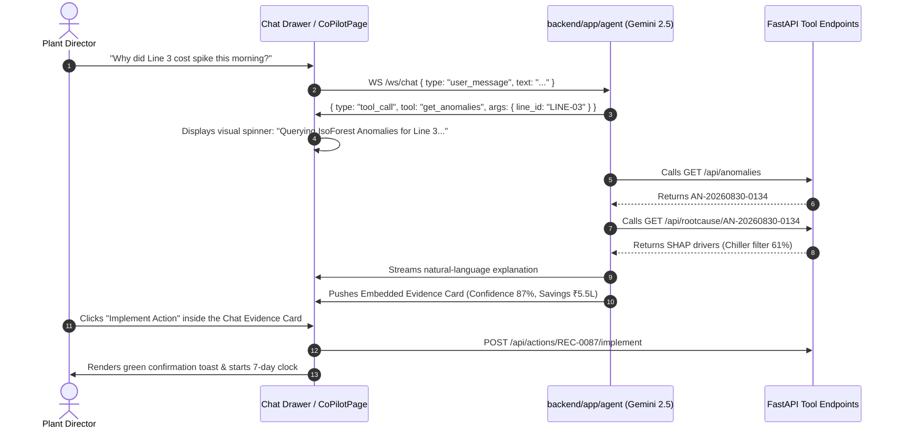
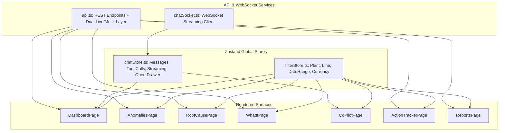

# Frontend Interactive Flows, UX Journeys & State Machines
## AI-Powered Industrial Cost Optimization Assistant — Working Prototype Reference

---

## 1. Scope & Purpose

This document specifies the end-to-end interactive user flows, state transitions, event lifecycles, and user journeys across the application's 7 surfaces.

---

## 2. Interactive Flow 1 — Anomaly to Root Cause to 1-Click Action

```mermaid
sequenceDiagram
    autonumber
    actor Ops as Plant Operations Manager
    participant Dash as Command Center / Anomaly Radar
    participant RCA as Root Cause Studio (SHAP)
    participant Opt as Optimization Engine
    participant Act as Action Tracker (7-Day Loop)

    Ops->>Dash: Notices Red Beacon on "Extruder 3A" (+22% Power Spike)
    Dash->>Ops: Displays Daily Cost Impact (₹18,400 / day)
    Ops->>Dash: Clicks "Root Cause AI" button
    Dash->>RCA: Loads /rootcause?anomalyId=AN-20260830-0134
    RCA->>Ops: Renders 4-Level Breadcrumb + SHAP Waterfall (61% Chiller Filter overdue)
    RCA->>Ops: Displays Confidence Dial (87% based on r=0.79 + 94% hist accuracy)
    Ops->>RCA: Clicks "Prescribed Action: Filter Cartridge Swap"
    RCA->>Opt: Ranks candidate scenario (Payback: 2 days, Savings: ₹5.5L/qtr)
    Ops->>Opt: Clicks "Implement Action"
    Opt->>Act: POST /api/actions/REC-0087/implement
    Act->>Ops: Starts 7-Day Verification Countdown (Due: 2026-09-06)
```

### Flow 1 UX Details
1. **Trigger**: Anomaly score > 0.70 flags the asset with a red glowing ring on the dashboard.
2. **Inspection**: User clicks into the asset card, immediately revealing the telemetry timeline with 90-day baseline upper/lower bands.
3. **Attribution**: The SHAP waterfall highlights the top 3 drivers with clear visual weight.
4. **Execution**: Clicking `Implement Action` transitions the recommendation into the closed-loop verification pipeline without leaving the screen.

---

## 3. Interactive Flow 2 — What-If Optimization Sandbox

```mermaid
flowchart TD
    A[User opens /whatif Sandbox] --> B[Adjusts Operational Parameters via Sliders]
    B --> C1[Slider 1: Temperature Trim -4°C]
    B --> C2[Slider 2: Shift Reschedule to Off-Peak Tariff]
    B --> C3[Slider 3: Maintenance Filter Replacement]
    C1 & C2 & C3 --> D[PuLP / OR-Tools Solver Evaluates Constraints]
    D --> E{Production & Capacity Constraints Satisfied?}
    E -->|Yes| F[Feasibility: TRUE | Rank by Payback & ROI]
    E -->|No| G[Feasibility: FALSE | Highlights Violated Constraint]
    F --> H[User selects Top Ranked Scenario and commits action]
```

### Interactive Sliders & Parameter Rules
| Parameter | Min / Max Range | Default Step | Affected Constraints |
|---|---|---|---|
| Barrel Temperature Trim | $-1^\circ\text{C}$ to $-10^\circ\text{C}$ | $1^\circ\text{C}$ | Polymer melt viscosity & scrap rate |
| Shift Rescheduling | Day Shift $\leftrightarrow$ Night Off-Peak | Discrete | Labor overtime & machine availability |
| Overhaul Level | Minor PM (15 min) $\leftrightarrow$ Major (36h) | Discrete | Monthly downtime quota (<18h limit) |

---

## 4. Interactive Flow 3 — Gemini AI Co-Pilot with Tool Use



---

## 5. Interactive Flow 4 — 7-Day Closed-Loop Verification

```
+---------------------------------------------------------------------------------------------------+
| DAY 0: ACTION IMPLEMENTED                                                                         |
| - Maintenance Team logs filter replacement                                                        |
| - Action record created: ACT-0451 (Status: pending_verification)                                  |
| - 7-Day Countdown Timer initiated                                                                 |
+---------------------------------------------------------------------------------------------------+
                                              |
                                              v
+---------------------------------------------------------------------------------------------------+
| DAYS 1 to 6: CONTINUOUS MONITORING                                                                |
| - Shop-floor IoT sensors stream energy & temperature readings every 60 seconds                     |
| - Telemetry compares against pre-action baseline                                                  |
+---------------------------------------------------------------------------------------------------+
                                              |
                                              v
+---------------------------------------------------------------------------------------------------+
| DAY 7: AUTOMATED KPI RE-MEASUREMENT                                                               |
| - Airflow DAG `kpi_remeasure_dag.py` triggers automatically                                       |
| - Computes post-action average energy draw (398.2 kWh vs pre-action 485.8 kWh)                    |
| - Verifies actual quarterly savings: ₹5.52 Lakh (Projected: ₹5.50 Lakh)                           |
| - Action status updated to: `verified`                                                            |
| - MLflow model registry recalibrates baseline models with new ground truth data                   |
+---------------------------------------------------------------------------------------------------+
```

---

## 6. Frontend State Management Architecture


