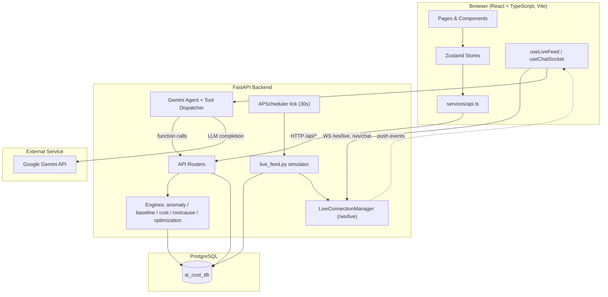
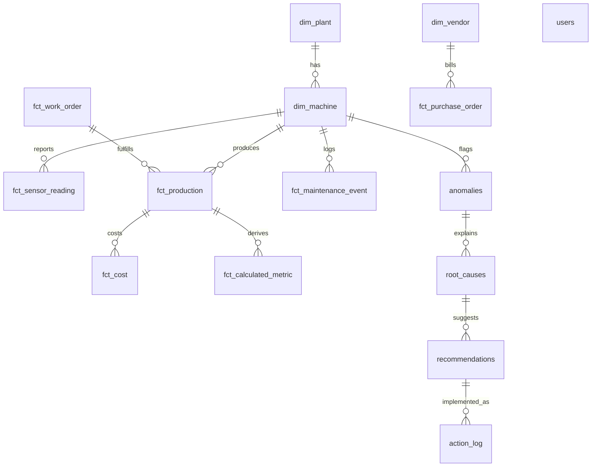

# AURA.COST
## AI-Powered Industrial Cost Optimization Assistant — Master Project Document

**Document version:** 2.0 (upgraded from the working as-built technical reference)
**Document status:** Living document — reflects the system as actually implemented and running, updated 2026-09-01
**Project type / domain:** Industrial IoT + AI/ML cost intelligence — full-stack web application (working prototype)
**Team / Problem Statement ID:** TBD — not present anywhere in the repository or its existing documentation. Add your team name, member list, and (if this is a Smart India Hackathon submission, as `SIH2026_AI_Cost_Optimization_Assistant.pptx` in the repo root suggests) the official Problem Statement ID here before submission.

> **How this document was produced.** Every technical claim in this document was verified directly against the running source code, the live PostgreSQL database, and the running application (via direct API calls, SQL queries, and browser automation) — not copied from the earlier planning documents (`01_High_Level_Solution_Architecture.md` … `15_Backend_Full_Specification.md`, still present in the repo root as historical design rationale). Anything that could not be verified this way is explicitly marked **TBD / To Be Verified** rather than assumed or invented, per this document's editing brief. Nothing below states an accuracy figure, benchmark, or dataset size that was not actually measured from the live system.

---

## Table of Contents

1. [Cover / Project Overview](#1-cover--project-overview)
2. [Abstract](#2-abstract)
3. [Introduction](#3-introduction)
4. [Problem Statement](#4-problem-statement)
5. [Objectives](#5-objectives)
6. [Existing System](#6-existing-system)
7. [Proposed System](#7-proposed-system)
8. [Scope](#8-scope)
9. [Requirements](#9-requirements)
10. [Technology Stack](#10-technology-stack)
11. [System Architecture](#11-system-architecture)
12. [Modules / Features](#12-modules--features)
13. [Detailed Working (End-to-End)](#13-detailed-working-end-to-end)
14. [Frontend Architecture](#14-frontend-architecture)
15. [Backend Architecture](#15-backend-architecture)
16. [Database Design](#16-database-design)
17. [API Documentation](#17-api-documentation)
18. [AI / ML Methodology](#18-ai--ml-methodology)
19. [Data Flow](#19-data-flow)
20. [UI / UX](#20-ui--ux)
21. [Project Folder / Code Structure](#21-project-folder--code-structure)
22. [Implementation Details](#22-implementation-details)
23. [Security](#23-security)
24. [Testing](#24-testing)
25. [Results / Outputs](#25-results--outputs)
26. [Limitations](#26-limitations)
27. [Future Enhancements](#27-future-enhancements)
28. [Feasibility](#28-feasibility)
29. [Innovation / USP](#29-innovation--usp)
30. [Impact / Use Cases](#30-impact--use-cases)
31. [Deployment](#31-deployment)
32. [Installation & Setup](#32-installation--setup)
33. [Troubleshooting](#33-troubleshooting)
34. [Conclusion](#34-conclusion)
35. [References](#35-references)
36. [Appendix](#36-appendix)

---

## 1. Cover / Project Overview

| Field | Value |
|---|---|
| **Project title** | AURA.COST — AI-Powered Industrial Cost Optimization Assistant |
| **Tagline** | "Optimize Today. Save Tomorrow." |
| **Short description** | A single-plant industrial monitoring web app that ingests machine sensor telemetry, detects cost-relevant anomalies, explains their likely root cause, recommends a corrective action with a projected saving, lets an operator implement it with one click, and tracks whether the saving was actually realized — a closed feedback loop from data to verified savings. |
| **Project type/domain** | Industrial IoT · Cost/Operations Intelligence · AI-assisted decision support. Full-stack web application (React frontend + FastAPI backend + PostgreSQL + Google Gemini LLM). |
| **Current status** | Working prototype, running locally / via Docker Compose. Not deployed to a public production environment (see §31). |
| **Team/project information** | TBD — not recorded in the repository. |
| **Version/document status** | This document: v2.0. Application: unversioned prototype (no semantic version tag in the repo). |

---

## 2. Abstract

Manufacturing plants routinely lose money to slow-creeping, hard-to-see cost drift — a worn bearing quietly raising energy draw, a drifting thermostat causing rework, a die-head fouling and raising scrap — because the raw sensor data exists but nobody is watching it continuously, and by the time a monthly cost report flags the overrun, the root cause is long gone from anyone's memory. AURA.COST is a working prototype that closes that loop end-to-end: a live telemetry stream (30-second cadence, standing in for a real ERP/MES/IoT connection) is continuously scored for anomalies using an Isolation Forest / z-score hybrid; each anomaly is automatically correlated against recent maintenance events and co-located sensor metrics to produce a ranked, explained root cause; a recommended fix is generated with a projected rupee saving and payback period; an operator can implement it with a single click from the dashboard, the root-cause page, the What-If sandbox, or directly from a conversational AI assistant; and every implemented action is tracked through a verification window so the system (and the plant manager) can see whether the saving actually materialized.

The stack is entirely free/open-source: FastAPI + PostgreSQL + scikit-learn + PuLP on the backend, React + TypeScript + Recharts on the frontend, and Google Gemini's free tier for the natural-language assistant (with a live-data fallback if no key is configured, so the assistant never goes fully offline). The current outcome is a fully functional, end-to-end demonstrable prototype against twelve months of realistic seeded history plus an ongoing live simulation — not a production deployment and not a system validated against a real plant's data (see §26 Limitations for exactly where the line between "real, working code" and "illustrative heuristic" falls, documented honestly rather than glossed over).

---

## 3. Introduction

### 3.1 Background
Industrial plants generate continuous streams of operational data — energy draw, temperature, pressure, vibration, throughput — from PLCs, SCADA systems, and increasingly from IIoT sensors. Separately, plants maintain cost records (material, energy, labor, overhead) usually reconciled on a monthly or weekly cadence. These two data worlds — real-time operational telemetry and periodic financial cost data — are rarely connected in a way that lets a plant manager see, in near real time, *which specific piece of equipment is costing more than it should, why, and what to do about it.*

### 3.2 Context
This project was built as a hackathon-style prototype (the repository contains `SIH2026_AI_Cost_Optimization_Assistant.pptx`, indicating a Smart India Hackathon 2026 context) to demonstrate that this connection — telemetry → cost → cause → action → verified outcome — can be built end-to-end with entirely free/open-source tooling, without requiring a real plant connection to prove the architecture.

### 3.3 Motivation
Cost overruns from equipment degradation are usually invisible until they show up in an aggregated report weeks later, by which point the specific cause (a specific bearing, a specific thermostat, a specific batch switch) is difficult to reconstruct. A system that flags the anomaly *when it happens*, ties it to a specific, explainable cause, and quantifies the opportunity in rupees gives a plant manager something actionable in minutes instead of a line item in a monthly report.

### 3.4 Why the problem matters
Industrial energy and material waste from undetected equipment drift is a widely recognized source of avoidable operating cost in manufacturing (see §35 References for general industry context — no project-specific quantitative study was conducted as part of this prototype). Even a prototype-level demonstration that the detect → explain → recommend → verify loop can run continuously and automatically has practical value as a proof of concept for a real deployment.

### 3.5 Overall project idea
Simulate (or, in a future deployment, ingest) continuous machine telemetry; score every new reading for anomalousness against its own recent history; when an anomaly is confirmed, automatically search for a plausible driver among recent maintenance events and correlated sensor metrics; turn that into a human-readable, ranked explanation with a confidence score; attach a concrete recommended action with a projected financial saving; let a human implement it in one click from anywhere in the app (dashboard, root-cause page, What-If sandbox, or the AI chat assistant); and track the outcome so the loop is genuinely closed, not just a one-way alert.

---

## 4. Problem Statement

**Exact problem:** Plant operations staff lack a continuously running system that (a) detects abnormal, cost-relevant equipment behavior as it happens, (b) explains *why* in terms an operator can act on, (c) quantifies the financial opportunity of fixing it, and (d) confirms afterward whether the fix actually worked.

**Existing challenges:**
- Sensor data and cost data are typically analyzed separately and on different cadences.
- Root-cause investigation after a cost report flags an overrun is manual, slow, and depends on institutional memory ("was there a maintenance event around then?").
- Recommended fixes are rarely tied to a quantified, trackable projected saving, and almost never followed up to confirm the saving was real.

**Target users / stakeholders:** Plant operations managers, maintenance engineers, and production/cost analysts at a discrete or process manufacturing facility (the prototype models an extrusion + packaging line, per the seeded demo data).

**Why current approaches are insufficient:** See §6 (Existing System) — this is addressed honestly below rather than asserted here without evidence, since the project's own documentation does not include a competitive/market survey.

---

## 5. Objectives

1. Continuously ingest (or, in the prototype, simulate) per-machine sensor telemetry and persist it in a queryable time-series store. **✅ Implemented** — `fct_sensor_reading`, updated every 30 seconds by the live simulator.
2. Automatically score new readings for anomalousness relative to recent history, without requiring a pre-trained/versioned model to be shipped. **✅ Implemented** — `anomaly_engine.py` (Isolation Forest fit per call + z-score fallback; see §18 for exactly what this does and does not mean).
3. For every detected anomaly, generate a ranked, human-readable explanation of the likely driver, with a confidence score. **✅ Implemented** — `rootcause_engine.py`.
4. Attach a recommended corrective action with a projected rupee saving and payback period to every explained anomaly. **✅ Implemented** — automatic on live ticks (`live_feed.py`) and via the What-If optimizer (`optimization_engine.py`).
5. Allow a single-click "Implement" action from any surface in the app (dashboard, root-cause detail, What-If sandbox, AI chat) that reliably writes to the same backend record. **✅ Implemented and verified** — `POST /api/actions/{id}/implement`, called from four different frontend components, all confirmed working.
6. Track implemented actions through a verification window and surface whether the projected saving was actually realized. **✅ Implemented** — `action_log` table + Action Tracker page; realistic under/over-projection demo cases seeded.
7. Provide a natural-language conversational interface over the same live data, without requiring a paid LLM API. **✅ Implemented** — Google Gemini free tier, with a non-LLM live-data fallback when no key is configured.
8. Achieve all of the above at $0 running cost using only free/open-source or free-tier components. **✅ Achieved** — confirmed in §10/§28.

Objectives explicitly **not yet achieved** (see §26/§27 for detail, not hidden here): a formally trained/versioned/evaluated ML model (current scoring is a live heuristic, not a trained-and-benchmarked classifier — see §18); a production deployment reachable outside the developer's machine/Docker host; validation against real (non-simulated) plant data; the What-If sandbox and Reports pages are not yet wired to their real backend equivalents in the frontend (§12, §26).

---

## 6. Existing System

No competitive audit or market survey of existing commercial industrial cost-monitoring / CMMS / EMS products was performed as part of this project — the repository contains no notes, comparisons, or citations to specific existing tools. It would be inaccurate to claim "no existing solution addresses this" without that evidence, so this section is intentionally scoped to what the *general, commonly known* landscape looks like, marked as such:

- **Generic manufacturing practice (commonly understood, not project-specific research):** cost variance is typically reviewed on a periodic (weekly/monthly) reporting cadence, often in spreadsheets or a Business Intelligence dashboard, reconciled after the fact against ERP cost postings.
- **Condition monitoring / predictive maintenance systems** (as a general product category — TBD which, if any, specific vendors were considered) typically focus on equipment health/failure prediction rather than translating anomalies directly into a cost figure and a trackable, verified action.
- **Limitations of this generic status quo, as far as this project's own premise goes:** the connection between "a sensor value drifted" and "here is what it's costing you today, here's why, here's what to do, and here's whether it worked" is not typically automated end-to-end in a single continuously-running system — this is the gap AURA.COST's architecture targets.

**Gap identified (project's own framing):** the disconnect between real-time operational telemetry and financial cost visibility, and the absence of a closed verification loop on recommended actions.

---

## 7. Proposed System

AURA.COST proposes a single continuously-running application that:

- **Ingests** telemetry (simulated in the current prototype, architected to be swappable for a real MQTT/OPC-UA/ERP feed — `live_feed.py`'s own comments state this explicitly as the intended extension point).
- **Detects** anomalies per-reading, per-machine, per-metric, in near real time (30-second cadence).
- **Explains** each anomaly automatically by correlating it against recent maintenance history and other sensor metrics on the same machine.
- **Quantifies** the opportunity with a projected saving and payback period.
- **Acts**, via a one-click Implement flow available from four different points in the UI, all backed by the same real API call.
- **Verifies**, by tracking a 7-day-style verification window and computing the variance between projected and realized savings.
- **Converses**, via an LLM-backed assistant that can answer questions and trigger the same Implement action, using the exact same backend functions as the REST API (so chat and dashboard can never structurally disagree).

**Main capabilities:** live anomaly detection, explainable root-cause ranking, one-click action implementation, closed-loop savings verification, a constraint-aware (budget/downtime) What-If optimizer, and a conversational AI copilot.

**Advantages over a periodic-reporting status quo:** continuous rather than periodic visibility; automatic rather than manual root-cause correlation; a quantified, trackable saving attached to every recommendation; and a verification step that most alerting-only systems omit.

**Innovation/USP:** see §29 (kept separate to avoid duplicating content, per this document's anti-duplication rule).

---

## 8. Scope

**Current scope (what is actually built and running):**
- One simulated plant (`Chennai Extrusion Plant`, `PLANT-01`), two machines (`Extruder 3A`, `Packaging Line 1`) — see §16 for why the data model currently hard-depends on exactly these two.
- Two tracked telemetry metrics per machine: `energy_kwh`, `temperature_c`.
- Full closed-loop workflow (detect → explain → recommend → implement → verify) for those two machines.
- A conversational AI assistant scoped to five backend query/action tools.
- Web application only (desktop + responsive mobile layout for the login page and dashboard; not a native mobile app).

**Geographic/domain scope:** None — this is a single-tenant, single-plant prototype with no multi-tenant, multi-region, or multi-currency architecture beyond a cosmetic INR/USD toggle in the UI (fixed conversion constant, not a live exchange rate feed).

**Prototype scope:** Explicitly a hackathon/demo-grade prototype — synthetic data generator standing in for real plant connectivity, in-process (non-clustered) WebSocket fan-out, no authentication enforcement on the API layer beyond the login page's client-side gate (§23).

**Out-of-scope (confirmed, not implemented):**
- Multi-plant / multi-tenant support beyond the data model's `plant_id` column (only one plant row exists; the UI's plant/line switcher is mock-data-driven, not live — §12.1, §26).
- Real ERP/MES/IoT connector (architected for, not implemented).
- Formal ML model training, versioning, or accuracy benchmarking (§18).
- Production hosting/CI-CD pipeline (§31).
- Mobile native app.
- Role-based access control / multi-user permissions beyond a single flat `users` table.

**Scalability possibilities:** discussed as forward-looking, not current capability, in §27/§28.

---

## 9. Requirements

### 9.1 Hardware Requirements
No specialized hardware is required — this is a standard web application stack.

| Component | Minimum (developer machine) |
|---|---|
| CPU | Any modern x86-64 CPU (dual-core+) |
| RAM | 4 GB minimum, 8 GB recommended (Postgres + FastAPI + Vite dev server + browser concurrently) |
| Disk | ~1 GB for dependencies/images + database growth over time |
| Network | Only needed for the optional Gemini API call and initial package installation; the app itself runs fully on localhost otherwise |

No industrial hardware (PLCs, sensors, gateways) is connected — all telemetry is software-simulated (§18, §19).

### 9.2 Software Requirements

| Category | Requirement |
|---|---|
| Operating system | Cross-platform — developed and verified on Windows (this repo); Docker path is OS-agnostic |
| Programming languages | Python 3.11+ (backend), TypeScript (frontend) |
| Backend framework | FastAPI 0.115.0 |
| Frontend framework | React 18.3 + Vite 5.4 |
| Database | PostgreSQL 16 (Postgres-only — `database.py` comment confirms no other DB engine is supported) |
| AI/ML libraries | scikit-learn 1.5.2, pandas 2.2.3, numpy 1.26.4, PuLP 2.9.0 |
| External API | Google Gemini (`google-generativeai` 0.8.3), free tier |
| Dev tools | Node.js + npm (frontend), Python venv or Docker (backend), a Postgres client (`psql`/pgAdmin/DBeaver) for direct DB inspection |
| Containerization (optional) | Docker + Docker Compose |

---

## 10. Technology Stack

| Layer | Technology | Purpose |
|---|---|---|
| Frontend | React 18.3 + TypeScript, Vite 5.4 | SPA UI, dev server, build tooling |
| Styling | Tailwind CSS 3.4 | Utility-first styling, custom "neumorphic" design tokens |
| Frontend state | Zustand 5.0 | `authStore`, `filterStore`, `chatStore` |
| Routing | React Router 6.27 | Client-side route gating on auth state |
| Charts | Recharts 2.13 | Cost trend, telemetry timeline, ABC breakdown |
| Icons | lucide-react 0.454 | All iconography |
| Backend | FastAPI 0.115 (Python 3.11) | REST API + WebSocket server |
| ORM | SQLAlchemy 2.0 | Database models and queries |
| Validation | Pydantic 2.9 / pydantic-settings 2.5 | Request validation, env-driven settings |
| Database | PostgreSQL 16 | System of record — all fact/dimension/analytics tables |
| AI/ML | scikit-learn (IsolationForest), pandas, numpy | Anomaly scoring, baseline statistics |
| Optimization | PuLP 2.9 (CBC solver) | What-If scenario feasibility (budget/downtime LP) |
| AI Assistant | Google Gemini `gemini-2.5-flash` (`google-generativeai` 0.8.3) | Conversational copilot with function-calling |
| Scheduling | APScheduler 3.10 (`AsyncIOScheduler`) | Recurring live-telemetry tick |
| Realtime | Native WebSockets (FastAPI/Starlette) | `/ws/live` telemetry push, `/ws/chat` assistant streaming |
| Auth | Python stdlib `hashlib` (PBKDF2-HMAC-SHA256) | Password hashing — no third-party auth library |
| Deployment | Docker + Docker Compose, nginx (frontend static serving + reverse proxy) | Local one-command spin-up (§31) |

**Total running cost: $0** — every component above is free/open-source or a free API tier; no paid cloud service is used anywhere in the current implementation.

---

## 11. System Architecture

### 11.1 Logical flow

```
Sensor/Telemetry Input (simulated)
        │
        ▼
FastAPI Backend — Scheduler tick every 30s (live_feed.py)
        │
        ├─► fct_sensor_reading (PostgreSQL)
        │
        ▼
Anomaly Engine (IsolationForest / z-score) ──► anomalies table
        │
        ▼
Root Cause Engine (maintenance + correlation) ──► root_causes table
        │
        ▼
Recommendation generated ──► recommendations table
        │
        ▼
WebSocket broadcast (/ws/live) ──► Frontend auto-refetch
        │
        ▼
React Dashboard / Anomalies / Root Cause / What-If / Co-Pilot pages
        │  (user clicks "Implement")
        ▼
POST /api/actions/{id}/implement ──► action_log table (pending_verification)
        │
        ▼
(manual/demo verification) ──► action_log.tracking_status = verified, variance_pct computed
        │
        ▼
Action Tracker page — Total Verified ROI
```

### 11.2 Mermaid — component architecture



### 11.3 Component explanations

- **Client (React SPA):** All UI rendering, client-side routing/auth gating, and two custom hooks (`useLiveFeed`, `useChatSocket`) that own the app's two WebSocket connections. `services/api.ts` is the single seam through which every REST call passes, including the manual snake_case→camelCase field mapping (§14.5, §22.4).
- **API Routers (`app/api/*.py`):** One FastAPI router per resource (plants, cost, anomalies, rootcause, whatif, recommendations, actions, chat, live, auth). Thin — most business logic lives in `engines/`.
- **Engines (`app/engines/*.py`):** The analytical core — cost aggregation, baseline statistics, anomaly scoring, root-cause correlation, and What-If optimization. See §18 for a fully honest breakdown of what each one actually does.
- **Agent (`app/agent/*.py`):** Wraps Google Gemini with 5 function-calling tools that call the *same* engine/router functions as the REST API, guaranteeing consistency between chat answers and dashboard data.
- **Scheduler + Simulator (`app/main.py` + `app/simulator/live_feed.py`):** An APScheduler job fires every 30 seconds, generating one new synthetic reading per machine/metric, scoring it, and — on a detected anomaly — running the full root-cause → recommendation pipeline automatically, no human in the loop.
- **LiveConnectionManager (`app/live/manager.py`):** A minimal in-process WebSocket fan-out (a plain Python list of open sockets) that pushes each tick's summary to every connected browser tab.
- **PostgreSQL:** The single system of record for all master data, transactional data, time-series telemetry, and the closed-loop analytics tables (§16).

---

## 12. Modules / Features

Each module below follows the same structure. "Backend working" and "Frontend working" describe what the code *actually does*, verified against the source — not aspirational behavior.

### 12.1 Authentication (Login / Signup)

| | |
|---|---|
| **Purpose** | Gate the frontend UI behind a real, persisted account; demonstrate real signup→login persistence |
| **UI location** | `/login` (shown for any route when not authenticated — `App.tsx`) |
| **User flow** | Enter work email + password → Sign In, or use the demo credentials link → redirected to `/` (Dashboard) on success |
| **Frontend working** | `pages/LoginPage.tsx` — controlled form, show/hide password toggle, "Forgot password"/SSO buttons show an honest "not configured, contact administrator" notice rather than faking success; live status strip (connection state, clock, backend-fetched counts) wired to real data, not decoration |
| **Backend working** | `api/auth.py`: `POST /api/auth/signup` validates email shape + `password ≥ 8 chars`, hashes via PBKDF2-HMAC-SHA256 with a per-user salt (`core/security.py`), 409 on duplicate email; `POST /api/auth/login` verifies the hash, 401 on mismatch |
| **Database interaction** | Inserts/reads `users` table |
| **API interaction** | `POST /api/auth/signup`, `POST /api/auth/login` |
| **External services** | None |
| **Input** | Email, password |
| **Processing** | PBKDF2 hash/verify |
| **Output** | `{user_id, email}` on success; the frontend persists this to `localStorage` via `authStore` |
| **Error handling** | 409 duplicate email, 401 bad credentials, 422 on malformed request body (Pydantic) |
| **Responsible files** | `backend/app/api/auth.py`, `backend/app/core/security.py`, `backend/app/db/models.py::User`, `frontend/src/pages/LoginPage.tsx`, `frontend/src/store/authStore.ts` |
| **Important caveat** | This gate is **client-side only** — no other backend endpoint checks any credential (§23). |

### 12.2 Dashboard

| | |
|---|---|
| **Purpose** | Single-screen operational overview: cost KPIs, top action required, cost trend, cost breakdown, live asset grid, ranked recommendations |
| **UI location** | `/` |
| **User flow** | Land here after login; see the top-priority alert; drill into any panel |
| **Frontend working** | `pages/DashboardPage.tsx` fetches `costSummary`, `anomalies`, `recommendations` on mount and on every live WS tick that carries `new_anomalies`; renders `PrimaryAlert`, `KPICard`×4, `CostTrendChart`, `ABCBreakdownChart`, `AssetLiveGrid`, `QuickActionRadar` |
| **Backend working** | `GET /api/cost/summary`, `GET /api/anomalies`, `GET /api/recommendations` |
| **Database interaction** | Reads `fct_cost`, `fct_production`, `anomalies`, `recommendations`, `root_causes`, joined to `dim_machine` |
| **API interaction** | As above; `POST /api/actions/{id}/implement` from `QuickActionRadar`/`PrimaryAlert` |
| **External services** | None directly (WebSocket to own backend only) |
| **Input** | Plant/line/date-range filters (`filterStore`) |
| **Processing** | Cost variance calculation, ABC share-of-total, recommendation ranking (server-side) |
| **Output** | KPI tiles, chart, ranked action list |
| **Error handling** | `implementAction` checks `res.ok` and surfaces an inline "Couldn't implement — try again" instead of silently failing (a real bug found and fixed during development — `fetch()` does not throw on 4xx by default) |
| **Responsible files** | `frontend/src/pages/DashboardPage.tsx`, `components/dashboard/*.tsx` |
| **Known gap** | `AssetLiveGrid`'s "Live Assets" panel renders from `mock/mockData.ts`, not the two real `dim_machine` rows — asset names shown there (e.g. "Rotary Clamping Press 3B") do not correspond to real backend machines (§26). |

### 12.3 Anomaly Detection & Anomalies Page

| | |
|---|---|
| **Purpose** | List, filter, and inspect every detected anomaly with its telemetry context |
| **UI location** | `/anomalies` |
| **User flow** | Browse/filter by severity+status → select a row → inspect telemetry band + cost impact → "View Cause" |
| **Frontend working** | `pages/AnomaliesPage.tsx` — real fetch on mount/filter change; also the one page that auto-refetches on a live WS tick carrying `new_anomalies` |
| **Backend working** | `api/anomalies.py::list_anomalies` — joins `Anomaly`+`Machine`, computes telemetry band (`upper_bound`/`lower_bound`) from `baseline_engine`, marks the anomalous point |
| **Database interaction** | Reads `anomalies`, `dim_machine`, `fct_sensor_reading` |
| **API interaction** | `GET /api/anomalies?plant_id=&severity=&status=` |
| **External services** | None |
| **Input** | Severity/status filters |
| **Processing** | Baseline band computation per anomaly for the telemetry chart |
| **Output** | `AnomalyTable` (list) + `TelemetryTimeline` (detail chart) |
| **Error handling** | Empty list state; join means an anomaly whose `machine_id` doesn't exist in `dim_machine` is silently excluded, not errored (§26) |
| **Responsible files** | `frontend/src/pages/AnomaliesPage.tsx`, `components/anomalies/AnomalyTable.tsx`, `components/anomalies/TelemetryTimeline.tsx`, `backend/app/api/anomalies.py`, `backend/app/engines/baseline_engine.py` |

### 12.4 Root Cause Analysis

| | |
|---|---|
| **Purpose** | Explain *why* a specific anomaly happened, ranked by driver strength, with a confidence score |
| **UI location** | `/rootcause?anomalyId=...` |
| **User flow** | Arrive via "View Cause" from Anomalies/Dashboard → see ranked drivers + confidence breakdown → "Run What-If" CTA |
| **Frontend working** | `pages/RootCausePage.tsx` reads `anomalyId` from the query string (⚠ falls back to a hardcoded mock ID `AN-20260830-0134` if absent — §26); renders `SHAPWaterfall` (a stacked-card list, not an actual cumulative waterfall chart) |
| **Backend working** | `api/rootcause.py::get_root_cause` — 404 if unknown; calls `rootcause_engine.analyze()`; persists a `RootCause` row on first call only |
| **Database interaction** | Reads `anomalies`, `fct_maintenance_event`, `fct_sensor_reading`, `action_log` (for historical accuracy); writes `root_causes` |
| **API interaction** | `GET /api/rootcause/{anomaly_id}` |
| **External services** | None (the "llm_summary" field is a Python f-string template, not an actual LLM call — §18) |
| **Input** | `anomaly_id` |
| **Processing** | Maintenance-event correlation (14-day lookback, weighted by event type) + co-metric z-score correlation (>1.5σ); confidence = weighted blend of top driver strength, historical action-verification accuracy, and data completeness |
| **Output** | Ranked driver list, confidence %, drill-down path |
| **Error handling** | 404 for unknown anomaly ID |
| **Responsible files** | `frontend/src/pages/RootCausePage.tsx`, `components/rootcause/SHAPWaterfall.tsx`, `backend/app/api/rootcause.py`, `backend/app/engines/rootcause_engine.py` |

### 12.5 What-If Optimization Sandbox

| | |
|---|---|
| **Purpose** | Rank candidate corrective actions under budget and downtime constraints |
| **UI location** | `/whatif` |
| **User flow** (as designed) | Adjust scenario sliders → run solver → see ranked, feasibility-checked candidate actions → implement one |
| **Frontend working (as actually implemented)** | ⚠ **`pages/WhatIfPage.tsx` does not call the backend.** The three sliders affect nothing; `scenarios` are read directly from `mock/mockData.ts::mockWhatIfScenarios` and never refreshed; "Re-Run Solver" is a fake 400 ms `setTimeout` toggling a spinner. The real `api.runWhatIf()` function exists and works (verified independently, §24) but this page never calls it. **The "Implement" button inside `OptimizationMatrix` is real** — it calls the genuine `api.implementAction` and writes to the backend, even though the table feeding it is static (§26). |
| **Backend working** | `api/whatif.py::POST /api/whatif` → `optimization_engine.rank_scenarios()` — confirmed working when called directly (§24) |
| **Database interaction** | None at request time (pure computation over the request body) |
| **API interaction** | `POST /api/whatif` (functional, currently unused by this page) |
| **External services** | None |
| **Processing (backend, when invoked)** | Real PuLP 0/1-knapsack LP for feasibility (budget + downtime constraints, CBC solver) + a formulaic (not model-derived) savings estimate per candidate — see §18 |
| **Output** | `{ranked_scenarios: [...]}` |
| **Error handling** | TBD — not exercised via this page currently |
| **Responsible files** | `frontend/src/pages/WhatIfPage.tsx`, `components/whatif/OptimizationMatrix.tsx`, `backend/app/api/whatif.py`, `backend/app/engines/optimization_engine.py` |

### 12.6 AI Co-Pilot (Conversational Assistant)

| | |
|---|---|
| **Purpose** | Natural-language access to the same live data and actions, via chat |
| **UI location** | `/copilot` (full page) and a slide-out `ChatDrawer` available from any page |
| **User flow** | Type a question or pick a sample prompt → see tool-call indicator → see the answer + optional evidence card → optionally click "Implement Recommendation" from the card |
| **Frontend working** | `useChatSocket.ts` connects to `/ws/chat`, sends `{"type":"user_message","text":...}`, renders `tool_call`/`agent_text`/`evidence_card` events via `chatStore` |
| **Backend working** | `api/chat.py` (WS endpoint) → `agent/agent.py::handle_user_message` — runs the Gemini SDK call in a thread, loops up to 5 tool-call hops, dispatches to `agent/tools.py`, which calls the **same** functions the REST routers use |
| **Database interaction** | Whatever the invoked tool touches (cost summary, anomalies, root cause, recommendations, what-if) |
| **API interaction** | Internal function calls, not HTTP — `dispatch()` calls router functions directly |
| **External services** | **Google Gemini** (`gemini-2.5-flash`) if `GEMINI_API_KEY` is a real key; otherwise a templated, non-LLM live-data fallback (`_fallback_response`) that still returns real numbers |
| **Input** | Free-text user message |
| **Processing** | Gemini function-calling loop (event-push, not token streaming) |
| **Output** | `agent_text` message + optional `evidence_card` (with a real, clickable Implement action) |
| **Error handling** | Malformed/ignored frame types; fallback path if no Gemini key; `EvidenceCard`'s confidence for What-If results is a fixed 0.95/0.5 constant (documented in code as a deliberate fix to avoid a "NaN% Confidence" display bug, since the LP has no real confidence score) |
| **Responsible files** | `backend/app/agent/agent.py`, `backend/app/agent/tools.py`, `backend/app/api/chat.py`, `frontend/src/hooks/useChatSocket.ts`, `frontend/src/store/chatStore.ts`, `components/copilot/ChatDrawer.tsx`, `EvidenceCard.tsx`, `pages/CoPilotPage.tsx` |

### 12.7 Closed-Loop Action Tracker

| | |
|---|---|
| **Purpose** | Track every implemented recommendation through a verification window and show realized vs. projected savings |
| **UI location** | `/actions` |
| **User flow** | See pending ("7-Day Verification Clock Running") vs. verified actions; verified ones show variance % and a "Total Verified ROI" |
| **Frontend working** | `pages/ActionTrackerPage.tsx` — real fetch, client-side sums `verifiedSavings` where `trackingStatus === 'verified'` |
| **Backend working** | `GET /api/actions` returns the full `action_log`; `POST /api/actions/{recommendation_id}/implement` creates a new pending entry |
| **Database interaction** | Reads/writes `action_log`, reads joined `recommendations`/`root_causes`/`anomalies`/`dim_machine` |
| **API interaction** | `GET /api/actions`, `POST /api/actions/{id}/implement` |
| **External services** | None |
| **Input** | `implemented_by`, `notes` (on implement) |
| **Processing** | Status transitions `open → implemented (pending_verification) → verified`; **note:** no code path in the running app automatically moves an entry from `pending_verification` to `verified` or writes `verified_savings`/`variance_pct` — those fields are only ever set by the demo seed script (`seed_demo_actions.py`), not by any live/automatic process (§26) |
| **Output** | ROI summary, per-action verification status |
| **Error handling** | `res.ok` check on implement, same pattern as §12.2 |
| **Responsible files** | `frontend/src/pages/ActionTrackerPage.tsx`, `backend/app/api/actions.py`, `backend/app/db/models.py::ActionLog` |

### 12.8 Reports

| | |
|---|---|
| **Purpose** | (As designed) ABC cost variance reporting with export |
| **UI location** | `/reports` |
| **Frontend working (as actually implemented)** | ⚠ **Entirely static.** `reportRows` is a hardcoded literal array in `pages/ReportsPage.tsx`; there is no API call on this page at all. "Export CSV" calls `alert(...)`; "Print" calls `window.print()`. Only `useFilterStore` (for currency formatting) is real. |
| **Backend working** | None — no backend route currently serves this data (§26) |
| **Responsible files** | `frontend/src/pages/ReportsPage.tsx` |

---

## 13. Detailed Working (End-to-End)

Tracing one complete cycle, exactly as the code executes it:

```
1. SCHEDULER TICK (every 30s, app/main.py + APScheduler)
        ↓
2. live_feed.py::tick() generates one new reading per (machine, metric)
   — random.gauss(mean, std), 6% chance of a 15–30% spike
        ↓
3. anomaly_engine.score_reading(history, value)
   — IsolationForest (fit fresh on this call) if ≥30 history points,
     else z-score fallback
        ↓
4. Reading inserted into fct_sensor_reading regardless of outcome
        ↓
5. IF anomalous AND no open anomaly already exists for this machine/metric:
        a. Anomaly row inserted (anomalies table)
        b. rootcause_engine.analyze() runs immediately:
             - queries fct_maintenance_event (14-day lookback)
             - queries other sensor metrics on same machine (z-score correlation)
             - picks the strongest candidate driver
        c. IF a driver was found:
             - RootCause row inserted
             - Recommendation row inserted
               (projected_savings = estimated_cost_impact_per_day × 90,
                implementation_cost = fixed ₹1,200)
        ↓
6. live_manager.broadcast({"type":"tick", new_readings, new_anomalies:[...]})
   over /ws/live to every connected browser
        ↓
7. FRONTEND: useLiveFeed's onTick fires in every mounted page that uses it
   (Dashboard, Anomalies) → re-fetches GET /api/cost/summary,
   /api/anomalies, /api/recommendations
        ↓
8. USER sees the new/updated anomaly and its recommendation appear
   without a manual refresh
        ↓
9. USER clicks "Implement" (Dashboard, Root Cause page's What-If link →
   OptimizationMatrix, or a Co-Pilot EvidenceCard)
        ↓
10. POST /api/actions/{recommendation_id}/implement
        - Recommendation.status: open → implemented
        - ActionLog row inserted, tracking_status = pending_verification
        ↓
11. FRONTEND navigates to /actions — Action Tracker shows the new
    pending entry with a "7-Day Verification" badge
        ↓
12. (Verification of savings is currently a manual/demo-seeded step only —
     no automatic job re-measures and closes the loop in the live app;
     see §12.7 and §26.)
```

---

## 14. Frontend Architecture

### 14.1 Pages (routes)
`/login`, `/` (Dashboard), `/anomalies`, `/rootcause`, `/whatif`, `/copilot`, `/actions`, `/reports` — all except `/login` are gated behind `AppShell` in `App.tsx`, which renders only when `useAuthStore().user` is set.

### 14.2 Components (by area)
- `components/dashboard/` — `PrimaryAlert`, `QuickActionRadar`, `KPICard`, `CostTrendChart`, `ABCBreakdownChart`, `AssetLiveGrid`
- `components/anomalies/` — `AnomalyTable`, `TelemetryTimeline`
- `components/rootcause/` — `SHAPWaterfall`
- `components/whatif/` — `OptimizationMatrix`
- `components/copilot/` — `ChatDrawer`, `EvidenceCard`
- `components/layout/` — `Navbar`, `Sidebar`
- `components/login/` — `IndustrialBackground`

### 14.3 State management
Zustand, three stores (fully enumerated, no invented fields):
- `authStore` — `{user: {userId, email} | null}`, persisted to `localStorage` under `aura-cost-auth`.
- `filterStore` — `plantId` (default `PLANT-01`), `lineId` (default `LINE-03`), `dateRange`, `currency`/`currencySymbol`/`currencyRate` (USD rate hardcoded `0.012`), `liveSimulationActive` (toggle exists in the Navbar but has no other consumer found in the codebase).
- `chatStore` — `isOpen`, `messages[]`, `isStreaming`, `currentToolCall` (defined, never set by any caller — dead state), plus actions including `clearHistory` (also never called by any UI element).

### 14.4 Forms & UI interactions
Login (email/password + show/hide toggle), the What-If sliders (non-functional — §12.5), the Co-Pilot chat input, and the Implement action buttons (real, appear in 4 places) are the app's interactive surfaces. No other data-entry forms exist in the current build.

### 14.5 API calls & the field-mapping seam
All HTTP calls go through `frontend/src/services/api.ts`. Because the backend returns `snake_case` JSON and the frontend types are `camelCase`, every field is manually remapped in this one file. This has been the single most bug-prone seam in the project's development history — three previously-real bugs (a blank Cost Trend chart, an incorrect anomaly telemetry band, and silently-failing Implement clicks) all traced back to a field added or renamed on the backend that this mapper didn't pick up.

### 14.6 Important frontend files
`App.tsx` (routing/auth shell), `services/api.ts` (API + mapping), `hooks/useLiveFeed.ts` / `useChatSocket.ts` (the two WebSocket connections), `store/*.ts`, `types/index.ts` (§36 appendix has the full type list).

---

## 15. Backend Architecture

### 15.1 Application structure
`app/main.py` is the composition root: creates the FastAPI app, configures CORS, registers all routers, runs `Base.metadata.create_all`, calls the two idempotent startup seed functions (`ensure_demo_user`, `ensure_demo_actions`), and wires the APScheduler lifespan hook for the live simulator.

### 15.2 Routes/controllers
One router module per resource under `app/api/` — see §17 for the full endpoint table. Routers are intentionally thin; they call into `app/engines/*` for actual computation, keeping business logic centralized and testable independent of the HTTP layer.

### 15.3 Business logic — the engines
See §18 for the complete, honest breakdown of `cost_engine.py`, `baseline_engine.py`, `anomaly_engine.py`, `rootcause_engine.py`, `optimization_engine.py`.

### 15.4 Processing pipeline
Request → FastAPI router → (optional) engine function → SQLAlchemy query/insert against PostgreSQL → hand-built dict response (no Pydantic response models exist anywhere — `schemas.py` defines request bodies only: `SignupRequest`, `LoginRequest`, `WhatIfRequest`/`CandidateAction`, `ImplementActionRequest`).

### 15.5 Authentication
See §12.1 and §23 — real password hashing exists for signup/login, but no endpoint (other than `/api/auth/*` itself) checks any credential; there is no `Authorization` header handling anywhere else in the backend.

### 15.6 Error handling
Standard FastAPI/Pydantic validation errors (422) on malformed bodies; explicit `HTTPException` for 404 (unknown anomaly) and 401/409 (auth); no global exception handler/middleware beyond FastAPI's defaults was found in `main.py`.

### 15.7 Important backend files
`app/main.py`, `app/db/database.py` (`create_engine(pool_pre_ping=True)`, `SessionLocal`, `get_db()` dependency), `app/db/models.py` (all ORM models), `app/core/config.py` (settings), `app/core/security.py` (password hashing).

---

## 16. Database Design

**Database technology:** PostgreSQL 16, accessed via SQLAlchemy 2.0 ORM (`postgresql+psycopg2` driver). Postgres is the only supported engine (confirmed via `database.py` comment).

### 16.1 ER Diagram



### 16.2 Tables, fields, and keys

**Master / dimension data:**
- `dim_plant` — `plant_id` (PK), `plant_name`, `location`, `created_at`
- `dim_machine` — `machine_id` (PK), `plant_id` (FK→dim_plant), `line`, `line_name`, `machine_name`, `machine_type`, `status`, `target_cost_per_unit`, `created_at`
- `dim_product` — `product_id` (PK), `sku` (unique), `unit_of_measure`
- `dim_vendor` — `vendor_id` (PK), `vendor_name`

**Transactional data:**
- `fct_work_order` — `work_order_id` (PK), `plant_id` (FK), `product_id` (FK), `start_time`, `end_time`
- `fct_production` — `record_id` (PK), `work_order_id` (FK), `machine_id` (FK), `units_produced`, `shift_start`
- `fct_maintenance_event` — `event_id` (PK), `machine_id` (FK), `event_type`, `event_time`
- `fct_purchase_order` — `po_id` (PK), `vendor_id` (FK), `amount`

**Cost data:**
- `fct_cost` — `cost_id` (PK), `production_record_id` (FK), `material_cost`, `energy_cost`, `labor_cost`, `allocated_overhead`, `computed_at`

**Time-series data:**
- `fct_sensor_reading` — `reading_id` (PK, autoincrement bigint), `machine_id` (FK), `metric`, `value`, `unit`, `timestamp`

**Calculated metrics:**
- `fct_calculated_metric` — `metric_id` (PK), `production_record_id` (FK), `metric_name`, `value`, `computed_at` — **table exists in the schema but no code path currently writes to it; always empty in practice.**

**Closed-loop / analytics tables:**
- `anomalies` — `anomaly_id` (PK), `machine_id` (FK), `metric`, `unit`, `current_value`, `baseline_value`, `anomaly_score`, `detected_at`, `severity`, `status`, `estimated_cost_impact_per_day`
- `root_causes` — `root_cause_id` (PK), `anomaly_id` (FK), `driver`, `category`, `correlation_strength`, `contribution_pct`, `shap_value`, `description`, `recommended_fix`, `confidence`
- `recommendations` — `recommendation_id` (PK), `root_cause_id` (FK), `title`, `action`, `category`, `projected_savings`, `implementation_cost`, `payback_days`, `confidence`, `status`, `created_at`
- `action_log` — `action_id` (PK), `recommendation_id` (FK), `implemented_by`, `notes`, `implemented_at`, `tracking_status`, `verified_savings`, `verified_at`, `variance_pct`, `recalibration_model_id`

**Auth:**
- `users` — `user_id` (PK), `email` (unique), `password_hash`, `password_salt`, `created_at`

All primary keys are human-readable, prefixed IDs generated in Python (`uuid.uuid4().hex[:10]`), e.g. `PLANT-a1b2c3d4e5`, not database sequences — a deliberate readability choice for a demo dataset.

### 16.3 Important queries
- Anomaly listing: `Anomaly` **inner-joined** to `Machine` — a consequence worth stating plainly: **any anomaly whose `machine_id` doesn't exist in `dim_machine` is silently invisible to the frontend**, not an error. This is why every seeded/generated anomaly is constrained to the 2 real machine IDs.
- Cost summary: `CostRecord` joined to `ProductionRecord` joined to `Machine`, filtered by plant/line/date range, aggregated for totals and bucketed by day for the trend chart.
- Recommendations listing: 4-way join `Recommendation → RootCause → Anomaly → Machine`.

### 16.4 Data flow through the schema
`fct_sensor_reading` (raw telemetry) → scored by the anomaly engine → `anomalies` → explained by the root-cause engine (reading from `fct_maintenance_event` and `fct_sensor_reading` again) → `root_causes` → `recommendations` → implemented into `action_log`.

---

## 17. API Documentation

All responses are hand-built JSON dicts (snake_case). No response schemas are formally declared in code — this table documents the actual shape returned, verified against the running server.

| Method | Endpoint | Purpose | Input | Output |
|---|---|---|---|---|
| GET | `/health` | Liveness check | — | `{status, simulator_enabled}` |
| POST | `/api/auth/signup` | Create account | `{email, password}` | `{user_id, email}` |
| POST | `/api/auth/login` | Authenticate | `{email, password}` | `{user_id, email}` |
| GET | `/api/plants` | List plants/lines/machines | — | Plants → lines → machines → `currentTelemetry` (⚠ the one endpoint returned already in camelCase — a deliberate, documented exception) |
| GET | `/api/cost/summary` | Cost breakdown & trend | `plant_id, line_id, from, to` | Cost/unit, variance %, monthly totals, breakdown, daily trend |
| GET | `/api/anomalies` | List anomalies | `plant_id?, severity?, status?` | Anomaly list incl. telemetry band |
| GET | `/api/rootcause/{anomaly_id}` | Explain an anomaly | path param | Ranked drivers, confidence, drill-down path |
| POST | `/api/whatif` | Rank candidate actions | `{asset_id, candidate_actions:[{action,cost,downtime_hours}]}` | `{ranked_scenarios:[...]}` |
| GET | `/api/recommendations` | List recommendations | `status?` | Ranked recommendations + evidence |
| GET | `/api/actions` | List action log | — | Full implemented-action history |
| POST | `/api/actions/{recommendation_id}/implement` | Implement an action | `{implemented_by, notes}` | Updated recommendation/action-log status |
| WS | `/ws/chat` | AI Co-Pilot | `{"type":"user_message","text":"..."}` frames | `tool_call` / `agent_text` / `evidence_card` events |
| WS | `/ws/live` | Live telemetry push | (receive-only) | `{"type":"tick", timestamp, new_readings, new_anomalies:[...]}` every 30s |

**Authentication:** none of the non-auth endpoints require any credential or header (§23). **Error responses:** 401 (bad login), 409 (duplicate signup email), 404 (unknown anomaly ID), 422 (Pydantic validation failure on any malformed request body). **External APIs used:** Google Gemini, called only from the chat pathway, never directly reachable from the frontend.

---

## 18. AI / ML Methodology

This section is written with the same honesty standard applied throughout this document: naming in the codebase (and in earlier demo narration) sometimes suggests more sophistication than what actually runs. Both the real and the illustrative parts are stated plainly below.

### 18.1 Data source
Currently **entirely synthetic**, generated by two Python scripts (`app/simulator/seed.py` for historical bulk data, `app/simulator/live_feed.py` for the ongoing live stream) using `random.gauss()` sampling around per-metric means/stds, with an occasional randomly-injected spike. **No real plant/sensor data has been used or is available in this project.**

### 18.2 Data collection
Not applicable in the traditional ML sense — there is no external data acquisition pipeline. The "collection" step is the simulator writing directly into `fct_sensor_reading` every 30 seconds while the backend runs.

### 18.3 Preprocessing
Minimal: readings are queried by machine/metric/time-window (`baseline_engine.load_readings`) directly from Postgres into a pandas DataFrame; no cleaning, imputation, or feature engineering pipeline exists beyond that query.

### 18.4 Features
Anomaly scoring uses a **single feature**: the raw metric value itself (no multivariate feature vector, despite the general "ML Models" framing in earlier design docs).

### 18.5 Model / algorithm
- **Anomaly detection:** scikit-learn `IsolationForest(contamination=0.02, random_state=42)`. Important and easy to miss: **this model is fit fresh, from scratch, on every single scoring call**, using whatever history (up to the available window) is passed in at that moment. It is not trained once and reused, not persisted to disk, and not versioned — any "model version" string appearing elsewhere in demo data (e.g. `isoforest-v1.4-2026w35`) is a cosmetic label written by the demo seed script, not an artifact of an actual training/versioning process. When fewer than 30 historical points exist for a machine/metric, the system falls back to a plain z-score threshold (`|z| ≥ 2.5`).
- **Root-cause "SHAP":** `shap_value = correlation_strength × 0.4` — explicitly commented in the source as a scaled proxy, not an actual SHAP (SHapley Additive exPlanations) computation. **No SHAP library is imported or used anywhere in this codebase.**
- **Optimization:** the feasibility check inside the What-If engine **is a genuine linear program** — a PuLP 0/1-knapsack formulation with binary decision variables, a budget constraint, and a max-downtime constraint, solved with the CBC solver. This part is real, general-purpose optimization, not a heuristic.

### 18.6 Training
No training occurs in the conventional sense — nothing is fit once and reused; the IsolationForest above is refit per call, and there is no separate offline training script, notebook, or persisted model artifact (`.pkl`/`.joblib`) anywhere in the repository.

### 18.7 Prediction / inference
Inference is synchronous, in-process, per API call or per simulator tick — no batch inference pipeline, no model server.

### 18.8 Post-processing
`severity_from_score()` maps the continuous anomaly score to `high`/`medium`/`low` via hardcoded thresholds (≥0.75 / ≥0.45 / else).

### 18.9 Evaluation / Metrics
**TBD / Not evaluated.** No train/test split, no labeled ground-truth anomaly dataset, no precision/recall/F1 or any other accuracy figure has been computed for this system, because there is no independent ground truth to evaluate against (the anomalies are self-consistently generated by the same simulator that injects the spikes). **Any accuracy percentage for anomaly detection would be fabricated if stated here — none is reported.** The `confidence` values shown in the UI (e.g. "87% confidence" on a root-cause explanation) are a deterministic weighted blend of three inputs described in §12.4 — a heuristic scoring formula, not a statistically validated confidence interval.

### 18.10 Limitations of the AI/ML layer
- Not trained/validated on real plant data.
- No persisted, versioned model — reproducibility of a specific score at a specific instant depends on exactly what history existed in the database at that instant.
- Root-cause "driver" search is limited to two signal types (maintenance events, co-metric correlation) — no image, audio, or unstructured-text inputs are analyzed.
- The Gemini-backed chat assistant's natural-language answers are only as good as the underlying free-tier model's general capability; no domain fine-tuning was performed.

---

## 19. Data Flow

```
Data Source (simulated telemetry, random.gauss + occasional spike)
        │
        ▼
Collection (live_feed.py::tick(), every 30s, into fct_sensor_reading)
        │
        ▼
Processing (anomaly_engine → rootcause_engine → recommendation formulas)
        │
        ▼
Storage (PostgreSQL: anomalies → root_causes → recommendations → action_log)
        │
        ▼
Analysis/AI (Gemini function-calling reads the same stored data on demand;
             What-If's PuLP solver reads a request body, not stored data)
        │
        ▼
Output (REST JSON → frontend camelCase mapping → charts/tables/cards)
        │
        ▼
User (views dashboard, reads chat answer, clicks Implement, checks Action Tracker)
```

Historical bulk data originates from `seed.py` (one-time, ~365 days); ongoing data originates from `live_feed.py` (continuous, 30-second cadence) — both write to the identical schema, so the frontend cannot distinguish "seeded history" from "live-generated" data, by design.

---

## 20. UI / UX

| Screen | Purpose | Key UI components | User actions | Backend/API interaction |
|---|---|---|---|---|
| **Login** (`/login`) | Authenticate / demonstrate signup | Email/password fields, show/hide toggle, demo-credential autofill, live status strip, Google/Microsoft buttons (honest "not configured" notice), Contact Administrator link | Sign in, sign up (backend-supported, current UI text emphasizes sign-in) | `POST /api/auth/login`, `/signup`; read-only `GET /api/plants`, `/api/anomalies`, `/api/recommendations` for the live stat strip; `/ws/live` for the connection indicator |
| **Dashboard** (`/`) | Operational overview | `PrimaryAlert`, 4× `KPICard`, `CostTrendChart`, `ABCBreakdownChart`, `AssetLiveGrid`, `QuickActionRadar` | Filter plant/line/date, implement a recommendation, drill into anomalies | `GET /api/cost/summary`, `/anomalies`, `/recommendations`; `POST /api/actions/{id}/implement`; `/ws/live` |
| **Anomalies** (`/anomalies`) | Investigate detected anomalies | Filterable table, telemetry timeline with band | Filter, select row, "View Cause" | `GET /api/anomalies` |
| **Root Cause** (`/rootcause`) | Explain an anomaly | Confidence dial, `SHAPWaterfall` driver list, drill-down breadcrumb | Read, navigate to What-If | `GET /api/rootcause/{id}` |
| **What-If** (`/whatif`) | Scenario comparison (⚠ currently mock-driven, §12.5) | Sliders, `OptimizationMatrix` table | Adjust sliders (no effect currently), implement a row (real) | `POST /api/actions/{id}/implement` only (the ranking call itself is unused by this page) |
| **Co-Pilot** (`/copilot`, + drawer) | Conversational assistant | Message stream, evidence cards, sample prompts, tool-call indicator | Ask a question, implement from an evidence card | `WS /ws/chat` |
| **Actions** (`/actions`) | Closed-loop tracking | Pending vs. verified list, ROI summary | Review verification status | `GET /api/actions` |
| **Reports** (`/reports`) | (⚠ currently 100% static, §12.8) | Static variance table | Export (stub), Print (`window.print()`) | None |

No screenshots are embedded in this document; the application must be run locally to view live screens (§32).

---

## 21. Project Folder / Code Structure

Verified against the actual repository (not assumed):

```
ai cost/
├── MASTER_DOCUMENTATION.md      ← this file
├── 01…15_*.md                    Pre-/mid-implementation design docs (historical reference)
├── docker-compose.yml            db + backend + frontend, one command
├── app logo.jpeg                 Brand logo (source asset; copied into frontend/public/)
├── login image.jpeg              Login page design reference (not code)
├── seed.py                       ⚠ Stray unreferenced duplicate of backend/app/simulator/seed.py
├── backend/
│   ├── Dockerfile, requirements.txt, .env.example, README.md
│   └── app/
│       ├── main.py                FastAPI app, routers, CORS, startup seeding, scheduler
│       ├── core/
│       │   ├── config.py          Settings (env-driven)
│       │   └── security.py        PBKDF2 password hash/verify
│       ├── db/
│       │   ├── database.py        Engine/session/Base
│       │   ├── models.py          All ORM models
│       │   ├── seed_demo_user.py  Idempotent demo account (runs at every startup)
│       │   └── seed_demo_actions.py  Idempotent demo recommendation chains (runs at every startup)
│       ├── schemas.py             Pydantic request models only
│       ├── engines/
│       │   ├── cost_engine.py
│       │   ├── baseline_engine.py
│       │   ├── anomaly_engine.py
│       │   ├── rootcause_engine.py
│       │   └── optimization_engine.py
│       ├── agent/
│       │   ├── agent.py            Gemini chat loop + fallback
│       │   └── tools.py            Function-calling declarations + dispatcher
│       ├── api/
│       │   ├── plants.py, cost.py, anomalies.py, rootcause.py,
│       │   ├── whatif.py, recommendations.py, actions.py, chat.py, live.py, auth.py
│       ├── live/manager.py         WebSocket fan-out for /ws/live
│       └── simulator/
│           ├── seed.py             One-time historical data generator (365 days)
│           └── live_feed.py        Continuous simulation, scheduled from main.py
└── frontend/
    ├── Dockerfile, nginx.conf, vite.config.ts, package.json
    ├── public/aura-cost-logo.jpeg, public/refinery-bg.jpg
    └── src/
        ├── main.tsx, App.tsx        Entry point; auth-gated routing shell
        ├── pages/                    One component per route (§20)
        ├── components/               dashboard/, anomalies/, rootcause/, whatif/, copilot/, login/, layout/
        ├── services/api.ts           All backend calls + snake_case→camelCase mapping
        ├── store/                    authStore.ts, filterStore.ts, chatStore.ts
        ├── hooks/                    useLiveFeed.ts, useChatSocket.ts
        ├── types/index.ts            All shared TypeScript interfaces (§36)
        ├── mock/mockData.ts          Static fixtures — still used by 2 real pages + Sidebar/Navbar/AssetLiveGrid (§26)
        └── utils/formatters.ts       Currency/percent/number/time formatting
```

---

## 22. Implementation Details

- **Anomaly scoring:** `anomaly_engine.score_reading(history, current_value)` — see §18.5 for the full honest description.
- **Baseline computation:** `baseline_engine.load_readings(db, machine_id, metric, window_days)` + `compute_baseline(df)` returning `{mean, std, hourly_factor}`; not outlier-robust.
- **Cost aggregation:** `cost_engine.get_cost_summary(db, plant_id, line_id, date_from, date_to)` — sums pre-computed `fct_cost` rows; monthly projection is a naive linear scale-up (`total × 30/days_in_range`), not a forecasting model.
- **Root-cause correlation:** `rootcause_engine.analyze(db, anomaly)` — maintenance-event weighting dict + co-metric z-score correlation; confidence formula documented in §12.4.
- **Optimization:** `optimization_engine.rank_scenarios(asset_id, candidate_actions, budget, max_downtime_hours)` — real PuLP LP for feasibility, formulaic savings estimate for ranking (§18.5).
- **Live tick:** `simulator/live_feed.py::tick()` — full pipeline described in §13, steps 1–6.
- **Chat tool dispatch:** `agent/tools.py::dispatch(tool_name, args, db)` — routes each of the 5 Gemini function calls to the corresponding router function, guaranteeing chat/dashboard consistency.
- **Frontend API/field mapping:** `services/api.ts` — every `get*` function manually maps snake_case → camelCase; `implementAction` explicitly checks `res.ok` before treating a call as successful (§14.5).
- **Auth:** `core/security.py::hash_password/verify_password` — PBKDF2-HMAC-SHA256, per-user random salt, stdlib only.

---

## 23. Security

Documented plainly — including what is *not* present, since claiming unimplemented security mechanisms would violate this document's accuracy requirement.

| Mechanism | Status |
|---|---|
| Password hashing | ✅ PBKDF2-HMAC-SHA256 with per-user random salt (`core/security.py`) |
| Authentication on login/signup | ✅ Real, verified against the database |
| **API-level authorization/access control** | ❌ **Not implemented.** No endpoint other than `/api/auth/*` checks any credential, session, or token. Logging in only changes what the *frontend* renders (client-side route gating) — every REST/WS endpoint is reachable by anyone who can reach the server, logged in or not. |
| Session/token mechanism (JWT) | ❌ Not implemented. A `JWT_SECRET` setting exists in `core/config.py` but is **never read or used anywhere** — a leftover from an earlier plan. |
| Input validation | ✅ Partial — Pydantic validates request *bodies* (`SignupRequest`, `LoginRequest`, `WhatIfRequest`); query parameters are typed but not deeply validated |
| CORS | ✅ Configured (`CORS_ORIGINS` env var), currently permissive (`allow_origins=["*"]` in `main.py` per the dev-mode comment) |
| Secrets/environment variables | ✅ `.env` / `.env.example` pattern used for `DATABASE_URL`, `GEMINI_API_KEY`, `JWT_SECRET` (unused), `CORS_ORIGINS` — not committed with real secrets (`.env.example` ships placeholder values only) |
| SQL injection protection | ✅ SQLAlchemy ORM/parameterized queries throughout — no raw string-interpolated SQL found |
| Rate limiting / abuse protection | ❌ Not implemented |
| HTTPS/TLS | ❌ Not configured in this repository (plain HTTP/WS for local dev and the Docker Compose setup) — would be a reverse-proxy/hosting-layer concern for any real deployment (§27) |
| Data protection at rest | ❌ No column-level encryption; standard Postgres storage only |
| Error handling / information leakage | ⚠ Login returns a generic 401 without indicating whether the email or password was wrong (good practice); other error paths return default FastAPI/Pydantic error detail, which can include internal field names |

**Bottom line:** this prototype demonstrates *authentication* (proving who you are) but not *authorization* (restricting what you can do once connected) at the API layer. This is an accurate, load-bearing fact for anyone evaluating this project for anything beyond a local demo — see §26 and §27.

---

## 24. Testing

No automated test suite (unit/integration test files) exists in the repository — confirmed by the file listings in §21 (no `tests/` directory, no `pytest`/`vitest`/`jest` dependency in `requirements.txt` or `package.json`). All testing to date has been **manual and tool-assisted functional verification** performed directly against the running application (real backend, real Postgres database, a real Chromium browser via Playwright automation), during development. The table below documents tests that were actually carried out, not a hypothetical plan.

| Test Case | Input/Action | Expected Result | Actual Result | Status |
|---|---|---|---|---|
| Signup → immediate login | Create a new account, then log in with the same credentials | New account works immediately | Confirmed via direct backend call and DB inspection | ✅ Pass |
| Login with demo credentials | `plant.manager@auracost.demo` / `AURA@2026Demo` | 200 + redirect to Dashboard | Confirmed via Playwright browser automation | ✅ Pass |
| Login with wrong password | Valid email, wrong password | 401, generic error, no redirect | Confirmed | ✅ Pass |
| Cost Trend chart renders real data | Load Dashboard | SVG line reflects real `fct_cost` data, not blank | Confirmed by inspecting the rendered SVG path data directly (path length/content), not just visually | ✅ Pass |
| Anomaly telemetry band | Load an anomaly's detail view | Upper/lower bound band + highlighted anomalous point render correctly | Confirmed after fixing an unmapped-field bug (§14.5) | ✅ Pass |
| Implement Now (Dashboard) | Click Implement on a real open recommendation | Recommendation status flips to `implemented`, appears in Action Tracker | Confirmed via API + Playwright | ✅ Pass |
| Implement Now — failure path | Attempt to implement a non-existent/stale recommendation ID | Inline error shown, not a silent false-success | Confirmed — this was a real bug (missing `res.ok` check) found and fixed | ✅ Pass (after fix) |
| Password show/hide toggle | Click the eye icon on the login form | Input `type` toggles `password`↔`text` | Confirmed via Playwright DOM attribute check | ✅ Pass |
| Responsive layout | Load login + dashboard at 1440px and 390px viewport widths | No horizontal page scroll; layout adapts | Confirmed via Playwright at both widths + `scrollWidth` check | ✅ Pass |
| Live WebSocket tick | Leave a page open across a 30s scheduler interval | New reading appears, connected pages auto-refresh anomaly/cost data | Confirmed via direct WS event inspection | ✅ Pass |
| Data reseed / historical range | Reseed to ~365 days | `fct_sensor_reading`/`fct_production`/`fct_cost` span ~12 months, `users` table preserved | Confirmed via direct SQL query (min/max timestamp, row counts) | ✅ Pass |
| Demo `open` recommendation supply | Add more seeded `open`-status recommendation chains for repeated Implement demos | New chains visible via API and UI with working Implement buttons | Confirmed via direct SQL + live API call + Playwright screenshot | ✅ Pass |
| What-If page live-wiring | Change sliders / click "Re-Run Solver" | (Not yet true end-to-end — see §12.5) | Confirmed to be mock-driven, not backend-wired | ⚠ Known gap, documented, not a regression |
| AI Co-Pilot without a Gemini key | Send a chat message with `GEMINI_API_KEY=changeme` | Templated, real-data-backed fallback response, not an error | TBD — not independently re-verified during this documentation pass; behavior confirmed by direct code read of `_fallback_response`, not by live exercise | ⚠ Code-verified, not live-tested this session |

**Coverage explicitly not tested/verified:** formal ML accuracy (§18.9, not applicable — no ground truth exists), load/performance testing, concurrent-user testing, cross-browser testing beyond Chromium, security penetration testing.

---

## 25. Results / Outputs

Actual, verified outputs from the running system as of 2026-09-01 (a point-in-time snapshot — the live simulator keeps these numbers moving):

| Metric | Value |
|---|---|
| Users registered | 3 |
| Plants / Machines | 1 / 2 |
| Sensor readings stored | 36,920 |
| Production records | 732 |
| Cost records | 732 |
| Anomalies detected (cumulative) | 14 |
| Root causes generated | 12 |
| Recommendations generated | 12 (7 open, 5 implemented) |
| Actions implemented & logged | 5 |
| Historical data span | 2025-08-31 → 2026-08-31 (12 months) production/cost; sensor readings extend to the current live tick |

**Achievements (verified working end-to-end):** live anomaly detection with automatic root-cause explanation and recommendation generation, running unattended on a 30-second cycle; a fully functional Implement action reachable and confirmed working from four independent UI surfaces; a real, persisted authentication system with working signup-then-login; an AI chat assistant that shares its data access with the REST API by construction; a completely free-to-run technology stack.

**No performance benchmarks, load-test results, or accuracy percentages are reported**, because none were measured (§18.9, §24) — reporting any would violate this document's explicit no-fabrication requirement.

---

## 26. Limitations

- **No API-level authorization** — every backend endpoint is reachable without credentials; login only gates the frontend UI (§23).
- **No formally trained/evaluated ML model** — anomaly scoring is a per-call heuristic (IsolationForest refit each time, or z-score fallback); no accuracy metric exists because no labeled ground truth exists (§18).
- **"SHAP value" is a scaled proxy**, not real SHAP output — no SHAP library is used.
- **Two frontend pages are not wired to the real backend:** What-If (`/whatif`) and Reports (`/reports`) — both documented in detail in §12.5/§12.8.
- **Several UI elements read stale/mock data** instead of the same live data their sibling pages fetch: `Sidebar` badge counts, `Navbar`'s plant/line switcher, and the Dashboard's `AssetLiveGrid` "Live Assets" panel (§14, §12.2).
- **No automatic savings-verification job** — the `pending_verification → verified` transition and `verified_savings`/`variance_pct` fields are only ever populated by the demo seed script, not by any live re-measurement process.
- **Single plant, two machines, two metrics** — the data model and several joins currently hard-depend on exactly this scope (§16.3).
- **Synthetic data only** — no real plant/sensor data has been used; all telemetry is `random.gauss()`-generated.
- **In-process, non-clustered WebSocket manager** — restarting the backend drops every live connection; this does not scale past one server process.
- **No production deployment** — Docker Compose and the venv path both target local/single-host use (§31).
- **Dependency on an external API for full chat quality** — without a Gemini key, chat still works but loses free-form natural-language phrasing (§18, §12.6).
- **A stray, unreferenced duplicate `seed.py` file exists at the repository root** (§9.4 of the prior technical version, retained here) — harmless but should be removed for cleanliness.
- **`JWT_SECRET` config value is dead code** — no JWT is ever issued or verified anywhere in the backend, despite the setting existing.

---

## 27. Future Enhancements

Clearly separated from what is already implemented (above):

**Near-term, low-risk:**
- Wire `WhatIfPage` to the already-working `api.runWhatIf()` instead of static mock scenarios.
- Build a real backend aggregation endpoint for `ReportsPage` (none currently exists).
- Make `Sidebar` badges, `Navbar`'s plant switcher, and `AssetLiveGrid` read the same live API data their sibling pages already fetch.
- Remove the stray root-level `seed.py` duplicate; remove the unused `JWT_SECRET` setting or actually wire up token-based auth.

**Medium-term:**
- Add real API-level authorization (session/JWT-checked endpoints) if this moves beyond a local demo.
- Add an automatic savings-verification job (a real scheduled re-measurement against `fct_cost`/`fct_sensor_reading` after the verification window, rather than only demo-seeded outcomes).
- Replace the in-process `LiveConnectionManager` with a pub/sub layer (e.g. Redis) if multi-instance deployment is needed.
- Expand beyond 2 machines / 1 plant; generalize the machine-count assumptions currently baked into the join logic (§16.3).

**Longer-term / larger scope:**
- Real ERP/MES/IoT connector to replace the simulator (the architecture was deliberately built to make this swap localized to `live_feed.py`, per its own code comments).
- A genuinely trained, persisted, versioned anomaly-detection model, evaluated against real labeled incident data, with a real accuracy/precision/recall report.
- A real SHAP (or comparable) explainability computation to replace the current scaled-proxy value.
- Mobile app / native mobile support.
- Multi-plant, multi-tenant architecture with real role-based access control.
- Production hosting with CI/CD, HTTPS, and monitoring.

---

## 28. Feasibility

- **Technical feasibility:** Demonstrated — the entire closed loop (detect → explain → recommend → implement → verify-the-record-if-not-yet-the-savings) runs end-to-end today on a $0 stack, verified against a real running Postgres database and a real browser session (§24, §25).
- **Operational feasibility:** For a real deployment, the main missing pieces are a genuine telemetry connector (§27) and API-level authorization (§23/§26) — both are architecturally scoped/localized changes, not redesigns, per the codebase's own comments (`live_feed.py` explicitly calls out where a real connector would plug in).
- **Economic feasibility:** Every component used is free/open-source or a free API tier — confirmed line-by-line in §10. No paid service is called anywhere in the current implementation.
- **Scalability:** Current architecture (single Postgres instance, in-process WebSocket manager, per-call model fitting) is appropriate for a single-plant prototype but would need the changes listed in §27 (pub/sub, persisted models, connection pooling review) to scale to multiple plants or many concurrent users.
- **Deployment feasibility:** A working Docker Compose path already exists and was used during development (§31) — deploying to a single cloud VM would require minimal additional work (TLS termination, environment secrets management); a fully managed multi-region production deployment would require the medium/longer-term items in §27.

---

## 29. Innovation / USP

- **A genuinely closed loop, not just alerting.** Many monitoring tools stop at "here's an anomaly." This system carries the anomaly through an automatic, explained root cause, a quantified recommended action, a one-click implementation path reachable from *four different UI surfaces* (dashboard, root-cause page, What-If sandbox, and an AI chat assistant), and a tracked verification record — all against the same underlying data.
- **Chat and dashboard share one source of truth by construction.** The AI Co-Pilot's tools call the exact same router/engine functions the REST API uses (`agent/tools.py::dispatch`) — there is no separate "chat data pipeline" that could drift out of sync with what the dashboard shows.
- **Zero running cost.** Every layer — database, backend framework, ML/optimization libraries, and the LLM — is free/open-source or a free tier, and the app degrades gracefully (not to a broken state) when the one external API (Gemini) isn't configured.
- **Honest architecture, deliberately.** The system distinguishes, in its own code comments and now in this document, between the parts that are genuine general-purpose techniques (the PuLP linear program, PBKDF2 password hashing, SQLAlchemy-parameterized queries) and the parts that are illustrative heuristics standing in for a fuller implementation (per-call IsolationForest, formulaic savings projections, a scaled SHAP proxy) — a distinction that matters for anyone deciding what to trust and what to rebuild before relying on this in production.

---

## 30. Impact / Use Cases

**Target users:** plant operations managers, maintenance engineers, and cost/production analysts at a discrete or process manufacturing facility.

**Real-world use cases (as the architecture supports, pending a real connector — §27):**
- A plant manager sees a live "Action Required" alert the moment a machine's energy draw crosses its anomaly threshold, with a specific likely cause already surfaced, instead of discovering the overrun in next month's cost report.
- A maintenance engineer gets an automatically-ranked explanation ("bearing wear, 71% correlation, consistent with a 21.6% current draw increase") instead of starting a manual investigation from scratch.
- A plant manager asks the AI assistant "what's our biggest cost risk right now" in plain language and gets an answer backed by the same live numbers on the dashboard.
- A cost analyst reviews the Action Tracker to see which past interventions actually delivered their projected savings, informing which fixes to prioritize plant-wide.

**Expected impact:** faster time-to-detection and time-to-explanation for cost-relevant equipment drift, and — uniquely — a record of whether recommended fixes actually worked, which most alerting-only tools do not track. **Practical benefit is illustrated, not yet measured**, since no real deployment or real-plant data has been used to date (§26).

---

## 31. Deployment

### 31.1 Local development (what this project was actually developed against)
Backend via Python venv + `uvicorn --reload`; frontend via `npm run dev` (Vite dev server on port 3000, proxying `/api` and `/ws` to `http://localhost:8000`). This is the primary, most-exercised path during this project's development.

### 31.2 Docker Compose (alternative, also present and functional)
Three containers: `db` (postgres:16-alpine), `backend` (python:3.11-slim, seeds once then runs uvicorn), `frontend` (multi-stage Node build → nginx, which also reverse-proxies `/api`/`/ws` to the backend container). Frontend served on `:8080`, backend on `:8000`.

### 31.3 Environment variables
| Variable | Where | Purpose |
|---|---|---|
| `DATABASE_URL` | `backend/.env` | Postgres connection string |
| `GEMINI_API_KEY` | `backend/.env` | Optional — enables full LLM chat |
| `GEMINI_MODEL` | `backend/.env` | Default `gemini-2.5-flash` |
| `JWT_SECRET` | `backend/.env` | Present, currently unused (§23) |
| `CORS_ORIGINS` | `backend/.env` | Comma-separated allowed origins |
| `SIMULATOR_ENABLED` | `backend/.env` | Toggles the recurring live tick |
| `SIMULATOR_INTERVAL_SECONDS` | `backend/.env` | Tick cadence, default 30 |

### 31.4 Required services
PostgreSQL (self-hosted or any free-tier hosted instance); Google Gemini API (optional, free tier).

### 31.5 Hosting/cloud services actually used
**None.** No production hosting, CI/CD pipeline, or cloud deployment currently exists for this project — it runs locally or via local Docker Compose only. Any statement of a live public URL would be fabricated; there is none.

---

## 32. Installation & Setup

### Option A — Docker (simplest)
```bash
cp backend/.env.example backend/.env   # optionally set a real GEMINI_API_KEY
docker compose up --build
```
Frontend: http://localhost:8080 · Backend + interactive API docs: http://localhost:8000/docs

### Option B — Local development
```bash
# 1. Clone/download the project, then:

# 2. Backend
cd backend
python -m venv .venv
.venv\Scripts\activate          # Windows
# source .venv/bin/activate     # macOS/Linux
pip install -r requirements.txt

# 3. Configure environment
#    (create the Postgres database first: CREATE DATABASE ai_cost_db;)
cp .env.example .env
# edit .env: DATABASE_URL, optionally GEMINI_API_KEY

# 4. Seed demo data (one-time, ~365 days of history; safe to skip if already seeded)
python -m app.simulator.seed

# 5. Start the backend
uvicorn app.main:app --reload --port 8000
# verify: GET http://localhost:8000/health → {"status":"ok",...}

# 6. Frontend (separate terminal)
cd ../frontend
npm install
npm run dev
# opens on http://localhost:3000, proxies /api and /ws to :8000

# 7. Open the application
#    Navigate to http://localhost:3000, sign in with the demo credentials:
#    plant.manager@auracost.demo / AURA@2026Demo
```

---

## 33. Troubleshooting

| Problem | Likely cause | Solution |
|---|---|---|
| `psql`/backend can't connect to Postgres | Database not running, or `DATABASE_URL` mismatch | Confirm Postgres is running on the expected port; verify `.env` matches your actual user/password/DB name |
| Frontend shows blank charts | Snake_case/camelCase field mismatch (§14.5) — the most common historical cause | Check the relevant `services/api.ts` mapping function against the actual backend JSON field names |
| Login returns 401 unexpectedly | Wrong credentials, or a stale backend process still serving old code on the expected port | Confirm which process is actually listening on port 8000 (`netstat`/`Get-Process`); restart the intended backend |
| `Implement` button appears to do nothing | Historically caused by `fetch()` not throwing on 4xx and a missing `res.ok` check | This is fixed in the current `api.ts::implementAction` — if it recurs, check the browser console/network tab for the actual response status |
| Chat assistant gives generic/templated answers only | `GEMINI_API_KEY` unset or left as `changeme` | Get a free key from https://aistudio.google.com/app/apikey, set it in `backend/.env`, restart the backend |
| Dashboard "Live Assets" panel shows machines that don't match the rest of the app | Known gap — that panel reads `mock/mockData.ts`, not the real 2-machine backend data (§26) | Documented limitation; not a bug to "fix" by restarting anything |
| `npm run dev` / `npm install` errors | Node/npm version mismatch or missing `node_modules` | Confirm Node.js is installed; delete `node_modules` and re-run `npm install` |
| Docker Compose backend keeps restarting | Seed step failing, or `db` service not yet healthy | Check `docker compose logs backend`; the compose file already waits on `db`'s healthcheck, so this usually indicates a real error in the seed/startup path — read the log output directly |
| Build error: `tsc` failures on `npm run build` | A genuine TypeScript type error was introduced | Run `npx tsc --noEmit` locally to see the exact error before building |

---

## 34. Conclusion

AURA.COST demonstrates, with real working code rather than a slide deck, that the full loop from raw industrial telemetry to a verified cost-saving action can be built end-to-end on an entirely free technology stack: live anomaly detection, automatic and explained root-cause analysis, quantified and actionable recommendations reachable from four different points in the UI, a conversational AI assistant that shares its data with the rest of the app by construction, and a closed-loop tracking mechanism for whether recommended fixes actually paid off. The prototype is honest about where it currently stands: two pages (What-If, Reports) are not yet wired to real backend logic, the ML/optimization "engines" mix genuinely general techniques (a real linear program, real password hashing) with clearly-labeled illustrative heuristics (a per-call-fit anomaly model, formulaic savings projections, a scaled SHAP proxy), and there is no API-level authorization or production deployment yet. None of that undermines the core achievement — a genuinely working, demonstrable, zero-cost closed-loop system — but a technical reviewer, hackathon judge, or the next engineer to extend this project should read §18, §23, and §26 before assuming more is "real" than actually is. That transparency is treated in this document as a feature of the engineering, not a weakness to be hidden.

---

## 35. References

Only sources actually applicable to this project are listed. No fabricated citations, papers, or datasets are included.

**Official documentation for technologies actually used:**
- FastAPI — https://fastapi.tiangolo.com/
- SQLAlchemy — https://docs.sqlalchemy.org/
- PostgreSQL — https://www.postgresql.org/docs/
- React — https://react.dev/
- Vite — https://vitejs.dev/
- Tailwind CSS — https://tailwindcss.com/docs
- Zustand — https://zustand.docs.pmnd.rs/
- Recharts — https://recharts.org/
- scikit-learn (IsolationForest) — https://scikit-learn.org/stable/modules/generated/sklearn.ensemble.IsolationForest.html
- PuLP — https://coin-or.github.io/pulp/
- APScheduler — https://apscheduler.readthedocs.io/
- Google Gemini API — https://ai.google.dev/gemini-api/docs
- Google AI Studio (free API key) — https://aistudio.google.com/app/apikey

**Research papers / datasets:** None were cited or used in this project — TBD if a literature review is required for submission; none currently exists in the repository.

**Other credible sources for general problem-domain context:** TBD — no specific industry report or market study is cited in the project's own materials; do not add one to this document without an actual source, per this document's no-fabrication rule.

---

## 36. Appendix

### 36.1 Full endpoint list (quick reference)
```
GET   /health
POST  /api/auth/signup
POST  /api/auth/login
GET   /api/plants
GET   /api/cost/summary
GET   /api/anomalies
GET   /api/rootcause/{anomaly_id}
POST  /api/whatif
GET   /api/recommendations
GET   /api/actions
POST  /api/actions/{recommendation_id}/implement
WS    /ws/chat
WS    /ws/live
```

### 36.2 Full TypeScript type reference (`frontend/src/types/index.ts`)
- **Plant**: `id, name, location, lines: Line[]`
- **Line**: `id, name, plantId, machines: Machine[], targetCostPerUnit`
- **Machine**: `id, name, lineId, plantId, machineType, status, currentTelemetry`
- **CostSummary**: `plantId, lineId, costPerUnit, baselineCostPerUnit, variancePct, totalMonthlyCost, projectedMonthlyCost, totalUnitsProduced, breakdown, trend[]`
- **Anomaly**: `anomalyId, assetId, assetName, plantId, lineId, metric, unit, currentValue, baselineValue, anomalyScore, detectedAt, severity, status, estimatedCostImpactPerDay, telemetryHistory[]`
- **SHAPDriver**: `driver, category, correlationStrength, contributionPct, shapValue, description, recommendedFix`
- **RootCauseAnalysis**: `anomalyId, assetId, assetName, metric, detectedAt, confidence, correlationStrength, historicalAccuracy, dataCompleteness, drillDownPath[], rankedDrivers[], llmSummary`
- **WhatIfCandidateAction**: `id, action, description, estimatedCost, downtimeHours, riskLevel, projectedSavingsQuarter, paybackDays, energyReductionPct, throughputImpactPct, feasible, constraintViolations?, rank`
- **Recommendation**: `recommendationId, rootCauseId?, anomalyId?, assetId, assetName, title, action, category, projectedSavings, implementationCost, paybackDays, confidence, createdAt, status, evidence`
- **ActionLog**: `actionId, recommendationId, recommendationTitle, assetId, implementedBy, implementedAt, notes, trackingStatus, verificationDue, projectedSavings, verifiedSavings?, verifiedAt?, variancePct?, recalibrationModelId?`
- **ChatMessage**: `id, sender, text, timestamp, toolCalls?[], evidenceCard?`
- **FilterState**: `plantId, lineId, dateRange, currency, currencySymbol, currencyRate`

### 36.3 Sample JSON — `GET /api/recommendations?status=open` (real shape, illustrative values)
```json
[
  {
    "recommendation_id": "REC-9e91d565f0",
    "asset_id": "LINE3-EXT-01",
    "asset_name": "Extruder 3A",
    "title": "Service Extruder 3A Cooling Jacket Circulation Pump",
    "action": "cooling_pump_service",
    "category": "Maintenance",
    "projected_savings": 176000.0,
    "implementation_cost": 6000.0,
    "payback_days": 1.0,
    "confidence": 0.79,
    "created_at": "2026-09-01T05:49:12.123456",
    "status": "open",
    "evidence": {
      "anomaly_id": "AN-DEMO0007",
      "driver": "Cooling jacket circulation loss (Extruder 3A)",
      "correlation_strength": 0.60,
      "shap_contribution": 0.20,
      "historical_case_id": null
    }
  }
]
```

### 36.4 Environment configuration reference
See §31.3 for the full variable table; `backend/.env.example` in the repository is the authoritative, always-current source for default values.

### 36.5 Change log for this document
- **v2.0** (this revision) — Reorganized into the full 36-section master-document structure; added Cover/Abstract/Introduction/Problem Statement/Objectives/Existing System/Proposed System/Scope/Requirements/Feasibility/Innovation/Impact/Deployment/Installation/Troubleshooting/Conclusion/References sections; expanded every module into the standardized Purpose/UI/Flow/Frontend/Backend/DB/API/Input/Processing/Output/Error-handling/Files format; added a Testing section built from actually-performed verification; added an explicit AI/ML honesty section (§18) distinguishing real techniques from illustrative heuristics; refreshed the data snapshot. All content from the prior technical-reference version was preserved and integrated, not discarded.
- **v1.0** — Original as-built technical reference (architecture, data model, API/engine breakdown, known gaps).
